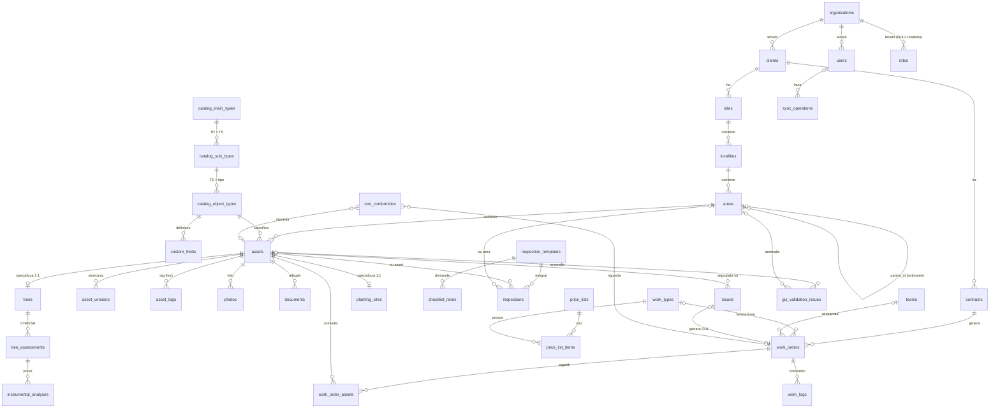

# GIS-DATA-MODEL.md — Schema dati GIS e censimento

**Progetto**: Piattaforma WebGIS gestione del verde
**Fase**: 0 — Progettazione di dettaglio
**Deriva da**: `PROPOSTA-ARCHITETTURA.md` §9 (Modello ER preliminare) e §10 (Strategia GIS)
**Stack di riferimento**: PostgreSQL 16 + PostGIS 3.4, Laravel 12 (PHP 8.4), Redis, MapLibre GL JS, ST_AsMVT
**Data**: 2026-08-10 — bozza per revisione interna

---

## Indice

1. [Convenzioni generali](#1-convenzioni-generali)
2. [DDL PostgreSQL 16 + PostGIS 3.4](#2-ddl-postgresql-16--postgis-34)
3. [Strategia di indicizzazione](#3-strategia-di-indicizzazione)
4. [Strategia CRS](#4-strategia-crs)
5. [Vincoli e trigger](#5-vincoli-e-trigger)
6. [Mapping conformità CAM / Modello Dati v2.1](#6-mapping-conformità-cam--modello-dati-v21)
7. [Query di validazione topologica](#7-query-di-validazione-topologica)
8. [Diagramma ER](#8-diagramma-er)
9. [Partizionamento e scalabilità futura](#9-partizionamento-e-scalabilità-futura)

---

## 1. Convenzioni generali

Regole valide per **tutte** le tabelle, salvo eccezione motivata nel commento della tabella.

| Convenzione | Regola | Motivazione |
|---|---|---|
| **Chiave primaria** | `id uuid PRIMARY KEY DEFAULT gen_random_uuid()` | Gli oggetti creati offline sulla PWA nascono con UUID generato client-side (Dexie): nessuna collisione, nessun rimappaggio in sync. `gen_random_uuid()` è nativo in PG ≥ 13, nessuna estensione richiesta. |
| **Tenancy** | `tenant_id uuid NOT NULL REFERENCES organizations(id)` su ogni tabella di dominio; global scope Eloquent + indici compositi con `tenant_id` in prima posizione | Multi-tenant row-level (§14 proposta). Uniche eccezioni: `organizations` stessa, `permissions` (catalogo permessi condiviso), partizioni di sistema. |
| **Soft delete** | `deleted_at timestamptz NULL`; mai `DELETE` fisico dall'applicazione (eccetto obblighi GDPR e tabelle tecniche) | Requisito "nessuna perdita silenziosa"; gli indici univoci di business sono **parziali** (`WHERE deleted_at IS NULL`) per consentire il riuso dei codici dopo cancellazione logica. |
| **Timestamps** | `created_at` / `updated_at timestamptz NOT NULL DEFAULT now()`; il cluster gira con `timezone = 'UTC'`; presentazione in `Europe/Rome` a carico dell'applicazione | `timestamptz` memorizza l'istante assoluto; evita ambiguità DST. |
| **Naming** | `snake_case`; tabelle al plurale inglese (`assets`, `work_orders`); FK `<singolare>_id`; pivot con i due nomi (`work_order_assets`); indici `ix_`, univoci `uq_`, spaziali `gist_`, JSONB `gin_`; trigger `trg_`; funzioni trigger `fn_trg_` | Coerenza con le convenzioni Laravel/Eloquent e leggibilità dei piani di esecuzione. |
| **Stati/workflow** | Stati **configurabili** (es. `work_orders.status`, `issues.status`) come `text` senza CHECK rigido, validati a livello applicativo contro la configurazione del tenant; stati **strutturali** (es. `sync_operations.status`) con `CHECK (...)` in DDL | La proposta (§9, §105) prevede workflow personalizzabili per tenant: un CHECK bloccherebbe la configurabilità. |
| **Optimistic locking** | `version integer NOT NULL DEFAULT 1` sulle tabelle scrivibili offline (`assets`, `work_logs`, `tree_assessments`, `work_orders`) | Rilevamento conflitti in sync: `UPDATE ... WHERE id=? AND version=?` → 0 righe = 409 con both-versions. |
| **Audit di riga** | `created_by` / `updated_by uuid REFERENCES users(id)` sulle tabelle di dominio principali | Alimenta `MODIF_DA` nell'export CAM e la timeline. |
| **Valori monetari / misure** | `numeric(14,2)` importi, `numeric(12,4)` prezzi unitari, `numeric` con scala esplicita per le misure; mai `float` | Determinismo nei computi/SAL. |
| **Geometrie** | SRID 4326 imposto dal typmod `geometry(<Tipo>,4326)`; asse lon/lat; misure derivate in colonne generate su EPSG:7791 (v. §4) | Dettaglio in §4. |
| **JSONB** | `attributes`/`payload`/`settings` sempre `jsonb NOT NULL DEFAULT '{}'::jsonb` | Evita il tri-stato NULL/`{}`/assente; indicizzabile GIN. |

Convenzione FK: `ON DELETE` è `RESTRICT` (default) per le relazioni di dominio — la cancellazione è logica — e `CASCADE` solo per i figli "parte-di" (versioni, righe checklist, righe pivot).

---

## 2. DDL PostgreSQL 16 + PostGIS 3.4

Il DDL è presentato in blocchi ordinati per dipendenza: eseguiti in sequenza creano lo schema senza forward reference (le poche dipendenze circolari sono risolte con `ALTER TABLE` finali). Nelle migrazioni Laravel ogni blocco corrisponde a una o più migration.

### 2.0 Prerequisiti, estensioni e funzioni comuni

```sql
-- Estensioni richieste (PostgreSQL 16, PostGIS 3.4)
CREATE EXTENSION IF NOT EXISTS postgis;      -- tipi geometry, ST_*, spatial_ref_sys (include EPSG:7791-7794)
CREATE EXTENSION IF NOT EXISTS pg_trgm;      -- ricerca fuzzy su nomi/specie (indici trigram)
CREATE EXTENSION IF NOT EXISTS citext;       -- email case-insensitive
CREATE EXTENSION IF NOT EXISTS btree_gist;   -- vincoli di esclusione misti (futuri) e GIST compositi

-- Il database gira in UTC
ALTER DATABASE webgis SET timezone TO 'UTC';

-- Funzione trigger comune: mantiene updated_at
CREATE OR REPLACE FUNCTION fn_trg_set_updated_at() RETURNS trigger
LANGUAGE plpgsql AS $$
BEGIN
  NEW.updated_at := now();
  RETURN NEW;
END $$;

-- Funzione trigger comune: rende una tabella append-only (v. §5.3)
CREATE OR REPLACE FUNCTION fn_trg_forbid_change() RETURNS trigger
LANGUAGE plpgsql AS $$
BEGIN
  RAISE EXCEPTION 'La tabella % è append-only: % non consentito', TG_TABLE_NAME, TG_OP
    USING ERRCODE = 'raise_exception';
END $$;
```

> Nota: per brevità i trigger `updated_at` non sono ripetuti tabella per tabella; vengono applicati a tutte le tabelle che possiedono la colonna con il blocco `DO` riportato in §5.2.

### 2.1 Tenancy e accesso

```sql
-- ============================================================
-- ORGANIZATIONS — il tenant (impresa che gestisce il verde)
-- ============================================================
CREATE TABLE organizations (
  id                  uuid PRIMARY KEY DEFAULT gen_random_uuid(),
  name                text NOT NULL,
  slug                text NOT NULL,                       -- subdominio/branding
  vat_number          text,
  metric_srid         integer NOT NULL DEFAULT 7791,       -- EPSG metrico per export/misure a video (7791..7794)
  settings            jsonb NOT NULL DEFAULT '{}'::jsonb,  -- configurazioni (workflow, numerazioni, moduli attivi)
  branding            jsonb NOT NULL DEFAULT '{}'::jsonb,  -- logo, colori, dominio dedicato
  is_active           boolean NOT NULL DEFAULT true,
  created_at          timestamptz NOT NULL DEFAULT now(),
  updated_at          timestamptz NOT NULL DEFAULT now(),
  deleted_at          timestamptz,
  CONSTRAINT uq_organizations_slug UNIQUE (slug),
  CONSTRAINT ck_organizations_metric_srid CHECK (metric_srid IN (7791, 7792, 7793, 7794))
);

-- ============================================================
-- USERS
-- ============================================================
CREATE TABLE users (
  id                  uuid PRIMARY KEY DEFAULT gen_random_uuid(),
  tenant_id           uuid NOT NULL REFERENCES organizations(id),
  name                text NOT NULL,
  email               citext NOT NULL,
  username            text,                                -- breve, usato per MODIF_DA nell'export CAM
  password_hash       text,                                -- NULL per utenti SSO/invitati
  phone               text,
  user_type           text NOT NULL DEFAULT 'internal'
                      CHECK (user_type IN ('internal','client_portal','public','api')),
  mfa_enabled         boolean NOT NULL DEFAULT false,
  mfa_secret          text,
  locale              text NOT NULL DEFAULT 'it',
  last_login_at       timestamptz,
  is_active           boolean NOT NULL DEFAULT true,
  created_at          timestamptz NOT NULL DEFAULT now(),
  updated_at          timestamptz NOT NULL DEFAULT now(),
  deleted_at          timestamptz
);
CREATE UNIQUE INDEX uq_users_tenant_email ON users (tenant_id, email) WHERE deleted_at IS NULL;
CREATE INDEX ix_users_tenant ON users (tenant_id) WHERE deleted_at IS NULL;

-- ============================================================
-- RUOLI E PERMESSI — schema spatie/laravel-permission con "teams"
-- (team_foreign_key = tenant_id). PK uuid al posto di bigint.
-- ============================================================
CREATE TABLE permissions (                                  -- catalogo permessi: GLOBALE, senza tenant_id
  id                  uuid PRIMARY KEY DEFAULT gen_random_uuid(),
  name                text NOT NULL,                        -- es. 'assets.update', 'vta.sign'
  guard_name          text NOT NULL DEFAULT 'web',
  created_at          timestamptz NOT NULL DEFAULT now(),
  updated_at          timestamptz NOT NULL DEFAULT now(),
  CONSTRAINT uq_permissions_name_guard UNIQUE (name, guard_name)
);

CREATE TABLE roles (
  id                  uuid PRIMARY KEY DEFAULT gen_random_uuid(),
  tenant_id           uuid REFERENCES organizations(id),    -- NULL = ruolo di sistema (seed condiviso)
  name                text NOT NULL,                        -- es. 'admin', 'caposquadra', 'agronomo'
  guard_name          text NOT NULL DEFAULT 'web',
  is_system           boolean NOT NULL DEFAULT false,
  created_at          timestamptz NOT NULL DEFAULT now(),
  updated_at          timestamptz NOT NULL DEFAULT now(),
  -- PG16: NULLS NOT DISTINCT ⇒ un solo ruolo 'admin' globale (tenant_id NULL)
  CONSTRAINT uq_roles_tenant_name_guard UNIQUE NULLS NOT DISTINCT (tenant_id, name, guard_name)
);

CREATE TABLE role_has_permissions (
  permission_id       uuid NOT NULL REFERENCES permissions(id) ON DELETE CASCADE,
  role_id             uuid NOT NULL REFERENCES roles(id) ON DELETE CASCADE,
  PRIMARY KEY (permission_id, role_id)
);

CREATE TABLE model_has_roles (                              -- assegnazione ruoli (polimorfica alla spatie)
  role_id             uuid NOT NULL REFERENCES roles(id) ON DELETE CASCADE,
  model_type          text NOT NULL,                        -- 'App\Models\User'
  model_id            uuid NOT NULL,
  tenant_id           uuid NOT NULL REFERENCES organizations(id),  -- team_foreign_key
  PRIMARY KEY (tenant_id, role_id, model_id, model_type)
);
CREATE INDEX ix_model_has_roles_model ON model_has_roles (model_id, model_type);

CREATE TABLE model_has_permissions (                        -- permessi diretti (eccezioni puntuali)
  permission_id       uuid NOT NULL REFERENCES permissions(id) ON DELETE CASCADE,
  model_type          text NOT NULL,
  model_id            uuid NOT NULL,
  tenant_id           uuid NOT NULL REFERENCES organizations(id),
  PRIMARY KEY (tenant_id, permission_id, model_id, model_type)
);
CREATE INDEX ix_model_has_permissions_model ON model_has_permissions (model_id, model_type);
```

### 2.2 Clienti e territorio

```sql
-- ============================================================
-- CLIENTS — i clienti del tenant (Comuni/PA, privati, condomini)
-- ============================================================
CREATE TABLE clients (
  id                  uuid PRIMARY KEY DEFAULT gen_random_uuid(),
  tenant_id           uuid NOT NULL REFERENCES organizations(id),
  code                text,                                  -- codice interno tenant
  name                text NOT NULL,
  client_type         text NOT NULL DEFAULT 'private'
                      CHECK (client_type IN ('public','private','condo','other')),  -- 'public' = PA (attesa 6-12 mesi)
  vat_number          text,
  fiscal_code         text,
  sdi_code            text,                                  -- fatturazione elettronica
  pec                 citext,
  ipa_code            text,                                  -- codice IPA per PA
  address             jsonb NOT NULL DEFAULT '{}'::jsonb,
  contacts            jsonb NOT NULL DEFAULT '{}'::jsonb,
  notes               text,
  is_active           boolean NOT NULL DEFAULT true,
  created_at          timestamptz NOT NULL DEFAULT now(),
  updated_at          timestamptz NOT NULL DEFAULT now(),
  deleted_at          timestamptz
);
CREATE UNIQUE INDEX uq_clients_tenant_code ON clients (tenant_id, code) WHERE deleted_at IS NULL;
CREATE INDEX ix_clients_tenant_name ON clients (tenant_id, name) WHERE deleted_at IS NULL;

-- ============================================================
-- CONTRACTS — appalti/contratti del cliente
-- ============================================================
CREATE TABLE contracts (
  id                  uuid PRIMARY KEY DEFAULT gen_random_uuid(),
  tenant_id           uuid NOT NULL REFERENCES organizations(id),
  client_id           uuid NOT NULL REFERENCES clients(id),
  code                text NOT NULL,
  title               text NOT NULL,
  contract_type       text CHECK (contract_type IN
                      ('appalto','global_service','manutenzione','censimento','pronto_intervento','altro')),
  cig                 text,                                  -- PA: Codice Identificativo Gara
  cup                 text,                                  -- PA: Codice Unico Progetto
  starts_on           date,
  ends_on             date,
  amount              numeric(14,2),
  currency            char(3) NOT NULL DEFAULT 'EUR',
  status              text NOT NULL DEFAULT 'draft',         -- workflow configurabile per tenant
  sla                 jsonb NOT NULL DEFAULT '{}'::jsonb,    -- tempi di presa in carico/risoluzione per severità
  notes               text,
  created_at          timestamptz NOT NULL DEFAULT now(),
  updated_at          timestamptz NOT NULL DEFAULT now(),
  deleted_at          timestamptz,
  CONSTRAINT ck_contracts_dates CHECK (ends_on IS NULL OR starts_on IS NULL OR ends_on >= starts_on)
);
CREATE UNIQUE INDEX uq_contracts_tenant_code ON contracts (tenant_id, code) WHERE deleted_at IS NULL;
CREATE INDEX ix_contracts_tenant_client ON contracts (tenant_id, client_id) WHERE deleted_at IS NULL;

-- ============================================================
-- SITES — sedi/territori del cliente (tipicamente il Comune)
-- ============================================================
CREATE TABLE sites (
  id                  uuid PRIMARY KEY DEFAULT gen_random_uuid(),
  tenant_id           uuid NOT NULL REFERENCES organizations(id),
  client_id           uuid NOT NULL REFERENCES clients(id),
  code                text,
  name                text NOT NULL,
  istat_code          varchar(6),                            -- CODE_ISTAT del comune (6 cifre)
  municipality        text,
  province            char(2),
  region              text,
  geom                geometry(MultiPolygon,4326),           -- perimetro complessivo (opzionale)
  created_at          timestamptz NOT NULL DEFAULT now(),
  updated_at          timestamptz NOT NULL DEFAULT now(),
  deleted_at          timestamptz
);
CREATE UNIQUE INDEX uq_sites_tenant_code ON sites (tenant_id, code) WHERE deleted_at IS NULL;
CREATE INDEX ix_sites_tenant_client ON sites (tenant_id, client_id) WHERE deleted_at IS NULL;
CREATE INDEX gist_sites_geom ON sites USING gist (geom);

-- ============================================================
-- LOCALITIES — zone/quartieri/frazioni dentro la sede
-- ============================================================
CREATE TABLE localities (
  id                  uuid PRIMARY KEY DEFAULT gen_random_uuid(),
  tenant_id           uuid NOT NULL REFERENCES organizations(id),
  site_id             uuid NOT NULL REFERENCES sites(id),
  code                text,                                  -- ZONA nell'export CAM
  name                text NOT NULL,
  survey_zone_code    text,                                  -- ID_ZRIL: identificativo zona di rilievo MD
  geom                geometry(MultiPolygon,4326),
  created_at          timestamptz NOT NULL DEFAULT now(),
  updated_at          timestamptz NOT NULL DEFAULT now(),
  deleted_at          timestamptz
);
CREATE UNIQUE INDEX uq_localities_site_code ON localities (tenant_id, site_id, code) WHERE deleted_at IS NULL;
CREATE INDEX ix_localities_tenant_site ON localities (tenant_id, site_id) WHERE deleted_at IS NULL;
CREATE INDEX gist_localities_geom ON localities USING gist (geom);

-- ============================================================
-- AREAS — aree verdi / perimetri di gestione, con gerarchia
-- ============================================================
CREATE TABLE areas (
  id                  uuid PRIMARY KEY DEFAULT gen_random_uuid(),
  tenant_id           uuid NOT NULL REFERENCES organizations(id),
  locality_id         uuid NOT NULL REFERENCES localities(id),
  parent_id           uuid REFERENCES areas(id),             -- self-ref: sottoaree
  code                text,                                  -- AREA nell'export CAM
  name                text NOT NULL,                         -- NOME_AREA
  area_type           text NOT NULL DEFAULT 'management'
                      CHECK (area_type IN ('management','functional','temporary')),
  status              text NOT NULL DEFAULT 'active'
                      CHECK (status IN ('planned','active','suspended','dismissed')),
  manager             text,                                  -- GESTORE (ente/impresa che gestisce)
  street_code         text,                                  -- CODE_VIA (codice via/toponimo)
  geom                geometry(MultiPolygon,4326) NOT NULL,
  computed_area_sqm   numeric(14,2) GENERATED ALWAYS AS
                      (round(ST_Area(ST_Transform(geom, 7791))::numeric, 2)) STORED,   -- AREA_mq
  computed_perimeter_m numeric(14,2) GENERATED ALWAYS AS
                      (round(ST_Perimeter(ST_Transform(geom, 7791))::numeric, 2)) STORED, -- PERIM_m
  valid_from          date NOT NULL DEFAULT CURRENT_DATE,    -- DATA_INI
  valid_to            date,                                  -- DATA_FINE
  notes               text,
  created_by          uuid REFERENCES users(id),
  updated_by          uuid REFERENCES users(id),
  created_at          timestamptz NOT NULL DEFAULT now(),
  updated_at          timestamptz NOT NULL DEFAULT now(),
  deleted_at          timestamptz,
  CONSTRAINT ck_areas_not_self_parent CHECK (parent_id IS DISTINCT FROM id),
  CONSTRAINT ck_areas_valid_dates CHECK (valid_to IS NULL OR valid_to >= valid_from)
);
CREATE UNIQUE INDEX uq_areas_tenant_code ON areas (tenant_id, code) WHERE deleted_at IS NULL;
CREATE INDEX ix_areas_tenant_locality ON areas (tenant_id, locality_id) WHERE deleted_at IS NULL;
CREATE INDEX ix_areas_parent ON areas (parent_id) WHERE deleted_at IS NULL;
CREATE INDEX gist_areas_geom ON areas USING gist (geom);
```

> La profondità della gerarchia `areas.parent_id` è libera (area → sottoarea → sub-sottoarea);
> l'anti-ciclo oltre il self-reference è garantito dal trigger `trg_areas_no_cycle` (§5.4).

### 2.3 Catalogo oggetti (TP / TS / tipi oggetto / campi custom)

```sql
-- ============================================================
-- CATALOG_MAIN_TYPES — macro-categorie (TP): es. Verde, Arredi, Impianti
-- Seed dal Modello Dati v2.1, forkato e personalizzabile per tenant.
-- ============================================================
CREATE TABLE catalog_main_types (
  id                  uuid PRIMARY KEY DEFAULT gen_random_uuid(),
  tenant_id           uuid NOT NULL REFERENCES organizations(id),
  code                varchar(4) NOT NULL,                   -- TP nell'export CAM (es. '1','2','3')
  name                text NOT NULL,
  is_cam              boolean NOT NULL DEFAULT true,         -- appartiene al set CAM/MD ufficiale
  sort_order          integer NOT NULL DEFAULT 0,
  created_at          timestamptz NOT NULL DEFAULT now(),
  updated_at          timestamptz NOT NULL DEFAULT now(),
  deleted_at          timestamptz
);
CREATE UNIQUE INDEX uq_cat_main_tenant_code ON catalog_main_types (tenant_id, code) WHERE deleted_at IS NULL;

-- ============================================================
-- CATALOG_SUB_TYPES — sottocategorie (TS)
-- ============================================================
CREATE TABLE catalog_sub_types (
  id                  uuid PRIMARY KEY DEFAULT gen_random_uuid(),
  tenant_id           uuid NOT NULL REFERENCES organizations(id),
  main_type_id        uuid NOT NULL REFERENCES catalog_main_types(id),
  code                varchar(4) NOT NULL,                   -- TS nell'export CAM
  name                text NOT NULL,
  is_cam              boolean NOT NULL DEFAULT true,
  sort_order          integer NOT NULL DEFAULT 0,
  created_at          timestamptz NOT NULL DEFAULT now(),
  updated_at          timestamptz NOT NULL DEFAULT now(),
  deleted_at          timestamptz
);
CREATE UNIQUE INDEX uq_cat_sub_tenant_main_code
  ON catalog_sub_types (tenant_id, main_type_id, code) WHERE deleted_at IS NULL;

-- ============================================================
-- CATALOG_OBJECT_TYPES — tipi oggetto censibili (codice TXYYZZZ)
-- ============================================================
CREATE TABLE catalog_object_types (
  id                  uuid PRIMARY KEY DEFAULT gen_random_uuid(),
  tenant_id           uuid NOT NULL REFERENCES organizations(id),
  sub_type_id         uuid NOT NULL REFERENCES catalog_sub_types(id),
  code                varchar(10) NOT NULL,                  -- CODICE nell'export CAM (formato TXYYZZZ)
  name                text NOT NULL,
  allowed_geometry    char(1) NOT NULL
                      CHECK (allowed_geometry IN ('P','L','S')),  -- P=punto, L=linea, S=superficie (come MD)
  cam_layer           varchar(3),                            -- layer shapefile export: P1,L1,S1,P2,L2,S2,P3,L3,S3,S4
  is_cam              boolean NOT NULL DEFAULT false,
  survey_mode         text,                                  -- modalità di rilievo consigliata
  reference_photo_key text,                                  -- foto-tipo su S3 (aiuto riconoscimento in campo)
  requires_tree_record boolean NOT NULL DEFAULT false,       -- true ⇒ alla creazione asset si crea record trees
  is_planting_site    boolean NOT NULL DEFAULT false,        -- true ⇒ "posto libero" (planting_sites)
  icon                text,
  style               jsonb NOT NULL DEFAULT '{}'::jsonb,    -- stile tematico MapLibre (colori per tenant)
  sort_order          integer NOT NULL DEFAULT 0,
  created_at          timestamptz NOT NULL DEFAULT now(),
  updated_at          timestamptz NOT NULL DEFAULT now(),
  deleted_at          timestamptz,
  CONSTRAINT ck_cat_obj_cam_layer CHECK (cam_layer IS NULL OR cam_layer IN
    ('P1','L1','S1','P2','L2','S2','P3','L3','S3','S4'))
);
CREATE UNIQUE INDEX uq_cat_obj_tenant_code ON catalog_object_types (tenant_id, code) WHERE deleted_at IS NULL;
CREATE INDEX ix_cat_obj_tenant_sub ON catalog_object_types (tenant_id, sub_type_id) WHERE deleted_at IS NULL;

-- ============================================================
-- CUSTOM_FIELDS — campi dinamici per tipo oggetto (Catalog Manager)
-- I valori vivono in assets.attributes (JSONB), chiave = custom_fields.key
-- ============================================================
CREATE TABLE custom_fields (
  id                  uuid PRIMARY KEY DEFAULT gen_random_uuid(),
  tenant_id           uuid NOT NULL REFERENCES organizations(id),
  object_type_id      uuid NOT NULL REFERENCES catalog_object_types(id),
  key                 text NOT NULL,                         -- snake_case, chiave in attributes
  label               text NOT NULL,
  field_type          text NOT NULL CHECK (field_type IN
                      ('text','textarea','integer','number','boolean','date','select','multiselect','photo','url')),
  required            boolean NOT NULL DEFAULT false,
  options             jsonb NOT NULL DEFAULT '[]'::jsonb,    -- lista valori per select/multiselect
  validation          jsonb NOT NULL DEFAULT '{}'::jsonb,    -- {min,max,regex,step,...}
  unit                text,                                  -- es. 'cm', 'mq'
  show_in_pwa         boolean NOT NULL DEFAULT true,
  cam_field           text,                                  -- se valorizzato: nome campo shapefile in export CAM
  sort_order          integer NOT NULL DEFAULT 0,
  created_at          timestamptz NOT NULL DEFAULT now(),
  updated_at          timestamptz NOT NULL DEFAULT now(),
  deleted_at          timestamptz
);
CREATE UNIQUE INDEX uq_custom_fields_type_key
  ON custom_fields (tenant_id, object_type_id, key) WHERE deleted_at IS NULL;
```

### 2.4 Patrimonio — cuore del censimento

```sql
-- ============================================================
-- ASSETS — entità geografica generica (ogni oggetto censito)
-- Geometria generica + attributi custom JSONB + misure calcolate.
-- ============================================================
CREATE TABLE assets (
  id                  uuid PRIMARY KEY DEFAULT gen_random_uuid(),   -- generabile client-side offline
  tenant_id           uuid NOT NULL REFERENCES organizations(id),
  area_id             uuid NOT NULL REFERENCES areas(id),
  object_type_id      uuid NOT NULL REFERENCES catalog_object_types(id),
  census_code         text,                                  -- OBJ_ID: codice censimento leggibile
  status              text NOT NULL DEFAULT 'active',        -- STATO: configurabile per tipo (validato in app)
  geom                geometry(Geometry,4326) NOT NULL,      -- tipo verificato dal trigger vs catalogo (§5.1)
  gps_accuracy_m      numeric(6,2),                          -- accuratezza dichiarata dal device
  survey_method       text CHECK (survey_method IN
                      ('gps','gps_rtk','digitized','cad_import','shapefile_import','manual_map','estimated')),
  surveyed_at         date,                                  -- DATA_RIL
  surveyed_by         uuid REFERENCES users(id),
  valid_from          date NOT NULL DEFAULT CURRENT_DATE,    -- DATA_INI (inizio validità/attivazione)
  valid_to            date,                                  -- DATA_FINE (dismissione/abbattimento)
  attributes          jsonb NOT NULL DEFAULT '{}'::jsonb,    -- valori dei custom_fields del tipo
  notes               text,                                  -- NOTE
  -- Misure derivate (colonne generate, v. §4): NULL quando non applicabili al tipo geometrico
  computed_area_sqm   numeric(14,2) GENERATED ALWAYS AS (
                        CASE WHEN GeometryType(geom) IN ('POLYGON','MULTIPOLYGON')
                             THEN round(ST_Area(ST_Transform(geom, 7791))::numeric, 2) END) STORED,
  computed_length_m   numeric(14,2) GENERATED ALWAYS AS (
                        CASE WHEN GeometryType(geom) IN ('LINESTRING','MULTILINESTRING')
                             THEN round(ST_Length(ST_Transform(geom, 7791))::numeric, 2) END) STORED,
  computed_perimeter_m numeric(14,2) GENERATED ALWAYS AS (
                        CASE WHEN GeometryType(geom) IN ('POLYGON','MULTIPOLYGON')
                             THEN round(ST_Perimeter(ST_Transform(geom, 7791))::numeric, 2) END) STORED,
  version             integer NOT NULL DEFAULT 1,            -- optimistic locking (sync offline)
  created_by          uuid REFERENCES users(id),
  updated_by          uuid REFERENCES users(id),             -- MODIF_DA
  created_at          timestamptz NOT NULL DEFAULT now(),
  updated_at          timestamptz NOT NULL DEFAULT now(),    -- DATA_AGG
  deleted_at          timestamptz,
  CONSTRAINT ck_assets_valid_dates CHECK (valid_to IS NULL OR valid_to >= valid_from),
  CONSTRAINT ck_assets_geom_not_empty CHECK (NOT ST_IsEmpty(geom))
);
CREATE UNIQUE INDEX uq_assets_tenant_census_code
  ON assets (tenant_id, census_code) WHERE deleted_at IS NULL AND census_code IS NOT NULL;
CREATE INDEX ix_assets_tenant_area   ON assets (tenant_id, area_id)        WHERE deleted_at IS NULL;
CREATE INDEX ix_assets_tenant_type   ON assets (tenant_id, object_type_id) WHERE deleted_at IS NULL;
CREATE INDEX ix_assets_tenant_status ON assets (tenant_id, status)         WHERE deleted_at IS NULL;
CREATE INDEX ix_assets_valid_range   ON assets (tenant_id, valid_from, valid_to);  -- mappa temporale "as of"
CREATE INDEX gist_assets_geom        ON assets USING gist (geom);
CREATE INDEX gin_assets_attributes   ON assets USING gin (attributes jsonb_path_ops);

-- ============================================================
-- ASSET_VERSIONS — storicizzazione campo per campo
-- Scritta dal trigger trg_assets_version (§5.5) a ogni UPDATE rilevante.
-- ============================================================
CREATE TABLE asset_versions (
  id                  uuid PRIMARY KEY DEFAULT gen_random_uuid(),
  tenant_id           uuid NOT NULL REFERENCES organizations(id),
  asset_id            uuid NOT NULL REFERENCES assets(id) ON DELETE CASCADE,
  version             integer NOT NULL,                      -- corrisponde ad assets.version fotografato
  snapshot            jsonb NOT NULL,                        -- stato completo della scheda alla versione
  diff                jsonb,                                 -- {campo: {"from": ..., "to": ...}}
  geom                geometry(Geometry,4326),               -- geometria storica (per mappa temporale)
  changed_by          uuid REFERENCES users(id),
  changed_at          timestamptz NOT NULL DEFAULT now(),
  change_source       text NOT NULL DEFAULT 'web'
                      CHECK (change_source IN ('web','pwa','sync','import','api','system')),
  CONSTRAINT uq_asset_versions_asset_version UNIQUE (asset_id, version)
);
CREATE INDEX ix_asset_versions_tenant_asset ON asset_versions (tenant_id, asset_id, changed_at DESC);
CREATE INDEX gist_asset_versions_geom ON asset_versions USING gist (geom);

-- ============================================================
-- ASSET_TAGS — tag fisici (NFC/QR/barcode/RFID/arbotag), storicizzati
-- Un tag "attivo" appartiene al più a un asset; i tag sostituiti/persi restano in storia.
-- ============================================================
CREATE TABLE asset_tags (
  id                  uuid PRIMARY KEY DEFAULT gen_random_uuid(),
  tenant_id           uuid NOT NULL REFERENCES organizations(id),
  asset_id            uuid REFERENCES assets(id),            -- NULL = tag prodotto ma non ancora associato
  tag_type            text NOT NULL CHECK (tag_type IN ('nfc','qr','barcode','rfid','arbotag')),
  uid                 text NOT NULL,                         -- UID NFC / contenuto QR-barcode / EPC RFID
  payload             jsonb NOT NULL DEFAULT '{}'::jsonb,    -- cosa è scritto sul tag: {uuid, url, schema_version}
  status              text NOT NULL DEFAULT 'active'
                      CHECK (status IN ('active','unassigned','replaced','lost','damaged','retired')),
  attached_by         uuid REFERENCES users(id),
  attached_at         timestamptz,
  detached_at         timestamptz,
  detach_reason       text,
  created_at          timestamptz NOT NULL DEFAULT now(),
  updated_at          timestamptz NOT NULL DEFAULT now()
);
-- univocità dell'identificativo fisico SOLO tra i tag vivi (la storia può contenere riusi)
CREATE UNIQUE INDEX uq_asset_tags_uid_active
  ON asset_tags (tenant_id, tag_type, uid) WHERE status IN ('active','unassigned');
CREATE INDEX ix_asset_tags_tenant_asset ON asset_tags (tenant_id, asset_id);
CREATE INDEX ix_asset_tags_lookup ON asset_tags (tag_type, uid);  -- risoluzione scan/tap cross-tenant → poi ACL

-- ============================================================
-- PHOTOS — foto georiferite (asset, ma anche lavori/ispezioni/segnalazioni)
-- ============================================================
CREATE TABLE photos (
  id                  uuid PRIMARY KEY DEFAULT gen_random_uuid(),
  tenant_id           uuid NOT NULL REFERENCES organizations(id),
  asset_id            uuid REFERENCES assets(id),
  subject_type        text,                                  -- polimorfico opzionale: 'work_log','inspection','issue'
  subject_id          uuid,
  category            text NOT NULL DEFAULT 'census' CHECK (category IN
                      ('census','reference','before','during','after','organ','defect','issue','signature','other')),
  s3_key              text NOT NULL,                         -- object storage Aruba, prefix per tenant
  thumb_s3_key        text,
  original_filename   text,                                  -- alimenta FOTO nell'export CAM
  mime_type           text NOT NULL DEFAULT 'image/jpeg',
  size_bytes          bigint,
  hash_sha256         char(64),                              -- dedup e integrità
  taken_at            timestamptz,
  exif                jsonb NOT NULL DEFAULT '{}'::jsonb,
  geom                geometry(Point,4326),                  -- posizione di scatto (da EXIF/GPS device)
  taken_by            uuid REFERENCES users(id),
  created_at          timestamptz NOT NULL DEFAULT now(),
  updated_at          timestamptz NOT NULL DEFAULT now(),
  deleted_at          timestamptz,
  CONSTRAINT ck_photos_subject CHECK (
    (subject_type IS NULL AND subject_id IS NULL) OR (subject_type IS NOT NULL AND subject_id IS NOT NULL))
);
CREATE INDEX ix_photos_tenant_asset ON photos (tenant_id, asset_id) WHERE deleted_at IS NULL;
CREATE INDEX ix_photos_subject ON photos (subject_type, subject_id) WHERE deleted_at IS NULL;
CREATE INDEX gist_photos_geom ON photos USING gist (geom);

-- ============================================================
-- DOCUMENTS — allegati (certificazioni, relazioni, schede tecniche)
-- ============================================================
CREATE TABLE documents (
  id                  uuid PRIMARY KEY DEFAULT gen_random_uuid(),
  tenant_id           uuid NOT NULL REFERENCES organizations(id),
  asset_id            uuid REFERENCES assets(id),
  subject_type        text,                                  -- polimorfico opzionale (contract, work_order, ...)
  subject_id          uuid,
  doc_type            text NOT NULL DEFAULT 'other' CHECK (doc_type IN
                      ('report','certificate','datasheet','photo_album','contract','invoice','map','vta_report','other')),
  title               text NOT NULL,
  s3_key              text NOT NULL,
  mime_type           text NOT NULL,
  size_bytes          bigint,
  hash_sha256         char(64),
  acl                 jsonb NOT NULL DEFAULT '{}'::jsonb,    -- visibilità: backoffice/cliente/pubblico
  uploaded_by         uuid REFERENCES users(id),
  created_at          timestamptz NOT NULL DEFAULT now(),
  updated_at          timestamptz NOT NULL DEFAULT now(),
  deleted_at          timestamptz,
  CONSTRAINT ck_documents_subject CHECK (
    (subject_type IS NULL AND subject_id IS NULL) OR (subject_type IS NOT NULL AND subject_id IS NOT NULL))
);
CREATE INDEX ix_documents_tenant_asset ON documents (tenant_id, asset_id) WHERE deleted_at IS NULL;
CREATE INDEX ix_documents_subject ON documents (subject_type, subject_id) WHERE deleted_at IS NULL;
```

### 2.5 Alberi, VTA, posti liberi

```sql
-- ============================================================
-- TREES — specializzazione 1:1 dell'asset di tipo albero
-- PK = FK verso assets: un albero È un asset (pattern class-table inheritance)
-- ============================================================
CREATE TABLE trees (
  asset_id            uuid PRIMARY KEY REFERENCES assets(id) ON DELETE CASCADE,
  tenant_id           uuid NOT NULL REFERENCES organizations(id),
  plant_number        text,                                  -- PT: progressivo pianta nell'area (export CAM)
  -- Tassonomia
  genus               text,                                  -- GENERE
  species             text,                                  -- SPECIE
  cultivar            text,                                  -- VARIETA
  family              text,
  common_name         text,
  -- Dendrometria (ultima misura ufficiale; la storia è in asset_versions)
  height_m            numeric(5,2),                          -- H_m
  dbh_cm              numeric(6,1),                          -- DIAM_TRONC: diametro fusto a 1,30 m
  trunk_circumference_cm numeric(7,1),                       -- circonferenza (ridondante con dbh, rilevata a scelta)
  trunk_count         smallint NOT NULL DEFAULT 1,           -- polloni/fusti multipli
  crown_diameter_m    numeric(5,2),                          -- DIAM_CHIOM
  crown_insertion_m   numeric(5,2),
  age_years_est       integer,
  age_class           text,
  vegetative_state    text,                                  -- STATO vegetativo (buono/medio/scarso/secco...)
  -- Flag e tutele
  is_monumental       boolean NOT NULL DEFAULT false,        -- L. 10/2013 art. 7 / elenco AMI
  monumental_ref      text,
  is_protected        boolean NOT NULL DEFAULT false,        -- vincoli (paesaggistico ecc.)
  protection_ref      text,
  is_dedicated        boolean NOT NULL DEFAULT false,        -- albero dedicato (L. 10/2013 "un albero per ogni nato")
  dedicated_to        jsonb NOT NULL DEFAULT '{}'::jsonb,    -- {nome, data_nascita, atto}: dati minimi, GDPR-aware
  has_stake           boolean NOT NULL DEFAULT false,        -- tutore
  has_bracing         boolean NOT NULL DEFAULT false,        -- consolidamenti
  bracing_notes       text,
  planted_on          date,
  removed_on          date,
  removal_reason      text,
  created_at          timestamptz NOT NULL DEFAULT now(),
  updated_at          timestamptz NOT NULL DEFAULT now()
);
CREATE INDEX ix_trees_tenant_species ON trees (tenant_id, genus, species);
CREATE INDEX gin_trees_species_trgm ON trees USING gin (species gin_trgm_ops);  -- ricerca fuzzy nomi botanici

-- ============================================================
-- TREE_ASSESSMENTS — valutazioni di stabilità (VTA/VSA), versionate
-- ============================================================
CREATE TABLE tree_assessments (
  id                  uuid PRIMARY KEY DEFAULT gen_random_uuid(),
  tenant_id           uuid NOT NULL REFERENCES organizations(id),
  tree_id             uuid NOT NULL REFERENCES trees(asset_id) ON DELETE CASCADE,
  assessment_type     text NOT NULL CHECK (assessment_type IN
                      ('vta_visual','vta_instrumental','vsa','pull_test','aerial_inspection','other')),
  assessed_on         date NOT NULL,
  assessor_id         uuid REFERENCES users(id),             -- tecnico interno
  assessor_external   text,                                  -- professionista esterno (nome/albo)
  defects             jsonb NOT NULL DEFAULT '{}'::jsonb,    -- per organo: {radici:[],colletto:[],fusto:[],branche:[],chioma:[]}
  targets             jsonb NOT NULL DEFAULT '{}'::jsonb,    -- bersagli (frequentazione, infrastrutture)
  failure_class       text,                                  -- classe di propensione al cedimento (A,B,C,C/D,D)
  outcome             text CHECK (outcome IN ('ok','monitor','prescriptions','fell')),
  prescriptions       text,                                  -- interventi prescritti
  next_check_due      date,                                  -- scadenzario ricontrolli
  version             integer NOT NULL DEFAULT 1,
  created_by          uuid REFERENCES users(id),
  updated_by          uuid REFERENCES users(id),
  created_at          timestamptz NOT NULL DEFAULT now(),
  updated_at          timestamptz NOT NULL DEFAULT now(),
  deleted_at          timestamptz
);
CREATE INDEX ix_tree_assessments_tenant_tree ON tree_assessments (tenant_id, tree_id, assessed_on DESC)
  WHERE deleted_at IS NULL;
CREATE INDEX ix_tree_assessments_due ON tree_assessments (tenant_id, next_check_due)
  WHERE deleted_at IS NULL AND next_check_due IS NOT NULL;
CREATE INDEX gin_tree_assessments_defects ON tree_assessments USING gin (defects jsonb_path_ops);

-- ============================================================
-- INSTRUMENTAL_ANALYSES — prove strumentali collegate alla valutazione
-- ============================================================
CREATE TABLE instrumental_analyses (
  id                  uuid PRIMARY KEY DEFAULT gen_random_uuid(),
  tenant_id           uuid NOT NULL REFERENCES organizations(id),
  assessment_id       uuid NOT NULL REFERENCES tree_assessments(id) ON DELETE CASCADE,
  instrument_type     text NOT NULL CHECK (instrument_type IN
                      ('resistograph','sonic_tomograph','electric_tomograph','pull_test','dendro_densimeter','other')),
  instrument_model    text,
  measured_at         timestamptz,
  measurement_height_cm integer,                             -- quota di misura sul fusto
  measures            jsonb NOT NULL DEFAULT '{}'::jsonb,    -- output numerico strumento
  document_id         uuid REFERENCES documents(id),         -- referto/tracciato allegato
  notes               text,
  created_at          timestamptz NOT NULL DEFAULT now(),
  updated_at          timestamptz NOT NULL DEFAULT now()
);
CREATE INDEX ix_instrumental_tenant_assessment ON instrumental_analyses (tenant_id, assessment_id);

-- ============================================================
-- PLANTING_SITES — "posti liberi" / sedi di impianto (bilancio arboreo)
-- Anche il posto vuoto è un asset (ha geometria puntuale e storia).
-- ============================================================
CREATE TABLE planting_sites (
  asset_id            uuid PRIMARY KEY REFERENCES assets(id) ON DELETE CASCADE,
  tenant_id           uuid NOT NULL REFERENCES organizations(id),
  status              text NOT NULL DEFAULT 'free'
                      CHECK (status IN ('free','reserved','planted','unusable')),
  planned_species     text,                                  -- specie prevista
  origin              text CHECK (origin IN ('felling','new_design','transplant','other')),
  previous_tree_id    uuid REFERENCES trees(asset_id),       -- albero abbattuto che ha originato il posto
  target_season       text,                                  -- stagione di impianto prevista (es. '2026-2027')
  notes               text,
  created_at          timestamptz NOT NULL DEFAULT now(),
  updated_at          timestamptz NOT NULL DEFAULT now()
);
CREATE INDEX ix_planting_sites_tenant_status ON planting_sites (tenant_id, status);
```

### 2.6 Ispezioni e checklist

```sql
-- ============================================================
-- INSPECTION_TEMPLATES — modelli di ispezione (es. EN 1176-7 aree gioco)
-- ============================================================
CREATE TABLE inspection_templates (
  id                  uuid PRIMARY KEY DEFAULT gen_random_uuid(),
  tenant_id           uuid NOT NULL REFERENCES organizations(id),
  code                text,
  name                text NOT NULL,
  target              text NOT NULL DEFAULT 'asset' CHECK (target IN ('asset','area')),
  object_type_id      uuid REFERENCES catalog_object_types(id),  -- opzionale: template legato a un tipo
  standard_ref        text,                                  -- es. 'UNI EN 1176-7:2020'
  frequency_days      integer,                               -- periodicità suggerita
  version             integer NOT NULL DEFAULT 1,            -- versione template (congelata nelle ispezioni)
  is_active           boolean NOT NULL DEFAULT true,
  created_at          timestamptz NOT NULL DEFAULT now(),
  updated_at          timestamptz NOT NULL DEFAULT now(),
  deleted_at          timestamptz
);
CREATE UNIQUE INDEX uq_inspection_templates_code
  ON inspection_templates (tenant_id, code) WHERE deleted_at IS NULL AND code IS NOT NULL;

-- ============================================================
-- CHECKLIST_ITEMS — domande del template
-- ============================================================
CREATE TABLE checklist_items (
  id                  uuid PRIMARY KEY DEFAULT gen_random_uuid(),
  tenant_id           uuid NOT NULL REFERENCES organizations(id),
  template_id         uuid NOT NULL REFERENCES inspection_templates(id) ON DELETE CASCADE,
  sort_order          integer NOT NULL DEFAULT 0,
  question            text NOT NULL,
  answer_type         text NOT NULL DEFAULT 'ok_ko' CHECK (answer_type IN
                      ('ok_ko','ok_ko_na','text','number','select','photo')),
  options             jsonb NOT NULL DEFAULT '[]'::jsonb,
  ko_creates_nc       boolean NOT NULL DEFAULT true,         -- risposta KO ⇒ apre non conformità
  photo_required_on_ko boolean NOT NULL DEFAULT true,
  attachment_required boolean NOT NULL DEFAULT false,
  weight              integer NOT NULL DEFAULT 1,            -- peso nell'esito complessivo
  visibility_condition jsonb NOT NULL DEFAULT '{}'::jsonb,   -- visibilità condizionale da risposte precedenti
  created_at          timestamptz NOT NULL DEFAULT now(),
  updated_at          timestamptz NOT NULL DEFAULT now()
);
CREATE INDEX ix_checklist_items_template ON checklist_items (template_id, sort_order);

-- ============================================================
-- INSPECTIONS — esecuzioni (compilabili offline in PWA)
-- ============================================================
CREATE TABLE inspections (
  id                  uuid PRIMARY KEY DEFAULT gen_random_uuid(),
  tenant_id           uuid NOT NULL REFERENCES organizations(id),
  template_id         uuid NOT NULL REFERENCES inspection_templates(id),
  template_version    integer NOT NULL,                      -- versione template congelata all'esecuzione
  asset_id            uuid REFERENCES assets(id),
  area_id             uuid REFERENCES areas(id),
  inspector_id        uuid NOT NULL REFERENCES users(id),
  started_at          timestamptz,
  completed_at        timestamptz,
  geom                geometry(Point,4326),                  -- posizione alla firma
  answers             jsonb NOT NULL DEFAULT '{}'::jsonb,    -- {checklist_item_id: {value, note, photo_ids[]}}
  outcome             text CHECK (outcome IN ('passed','passed_with_remarks','failed','not_completed')),
  signature_s3_key    text,
  version             integer NOT NULL DEFAULT 1,
  created_at          timestamptz NOT NULL DEFAULT now(),
  updated_at          timestamptz NOT NULL DEFAULT now(),
  deleted_at          timestamptz,
  CONSTRAINT ck_inspections_target CHECK (asset_id IS NOT NULL OR area_id IS NOT NULL)
);
CREATE INDEX ix_inspections_tenant_asset ON inspections (tenant_id, asset_id, completed_at DESC)
  WHERE deleted_at IS NULL;
CREATE INDEX ix_inspections_tenant_area ON inspections (tenant_id, area_id, completed_at DESC)
  WHERE deleted_at IS NULL;
CREATE INDEX gin_inspections_answers ON inspections USING gin (answers jsonb_path_ops);
```

### 2.7 Lavori, listini, economia

```sql
-- ============================================================
-- WORK_TYPES — lavorazioni (sfalcio, potatura, abbattimento...)
-- ============================================================
CREATE TABLE work_types (
  id                  uuid PRIMARY KEY DEFAULT gen_random_uuid(),
  tenant_id           uuid NOT NULL REFERENCES organizations(id),
  code                text NOT NULL,
  name                text NOT NULL,
  category            text,                                  -- raggruppamento (verde orizzontale/verticale/arredi...)
  unit                text NOT NULL,                         -- UdM: 'mq','ml','cad','h','kg'
  std_duration_min    integer,                               -- durata standard per unità
  default_frequency   jsonb NOT NULL DEFAULT '{}'::jsonb,    -- periodicità std {per_year, months[], note}
  applicable_geometry char(1) CHECK (applicable_geometry IN ('P','L','S')),  -- coerenza con tipi oggetto
  requires_photos     boolean NOT NULL DEFAULT false,        -- obbligo foto PRIMA/DOPO in consuntivo
  is_active           boolean NOT NULL DEFAULT true,
  created_at          timestamptz NOT NULL DEFAULT now(),
  updated_at          timestamptz NOT NULL DEFAULT now(),
  deleted_at          timestamptz
);
CREATE UNIQUE INDEX uq_work_types_tenant_code ON work_types (tenant_id, code) WHERE deleted_at IS NULL;

-- ============================================================
-- PRICE_LISTS / PRICE_LIST_ITEMS — listini prezzi
-- ============================================================
CREATE TABLE price_lists (
  id                  uuid PRIMARY KEY DEFAULT gen_random_uuid(),
  tenant_id           uuid NOT NULL REFERENCES organizations(id),
  code                text NOT NULL,
  name                text NOT NULL,
  source              text,                                  -- 'prezzario regionale', 'Assoverde', 'interno'
  year                integer,
  currency            char(3) NOT NULL DEFAULT 'EUR',
  valid_from          date,
  valid_to            date,
  is_active           boolean NOT NULL DEFAULT true,
  created_at          timestamptz NOT NULL DEFAULT now(),
  updated_at          timestamptz NOT NULL DEFAULT now(),
  deleted_at          timestamptz
);
CREATE UNIQUE INDEX uq_price_lists_tenant_code ON price_lists (tenant_id, code) WHERE deleted_at IS NULL;

CREATE TABLE price_list_items (
  id                  uuid PRIMARY KEY DEFAULT gen_random_uuid(),
  tenant_id           uuid NOT NULL REFERENCES organizations(id),
  price_list_id       uuid NOT NULL REFERENCES price_lists(id) ON DELETE CASCADE,
  work_type_id        uuid NOT NULL REFERENCES work_types(id),
  item_code           text,                                  -- voce di prezzario (es. 'E.021.010.a')
  description         text,
  unit                text NOT NULL,
  unit_price          numeric(12,4) NOT NULL,
  overhead_pct        numeric(5,2),                          -- spese generali %
  safety_cost         numeric(12,4),                         -- oneri sicurezza per unità
  created_at          timestamptz NOT NULL DEFAULT now(),
  updated_at          timestamptz NOT NULL DEFAULT now(),
  deleted_at          timestamptz
);
CREATE UNIQUE INDEX uq_price_list_items
  ON price_list_items (tenant_id, price_list_id, work_type_id, COALESCE(item_code,''))
  WHERE deleted_at IS NULL;

-- Pivot contratto ↔ listini applicabili (con priorità)
CREATE TABLE contract_price_lists (
  contract_id         uuid NOT NULL REFERENCES contracts(id) ON DELETE CASCADE,
  price_list_id       uuid NOT NULL REFERENCES price_lists(id) ON DELETE CASCADE,
  tenant_id           uuid NOT NULL REFERENCES organizations(id),
  priority            integer NOT NULL DEFAULT 0,
  PRIMARY KEY (contract_id, price_list_id)
);

-- ============================================================
-- TEAMS / TEAM_MEMBERS — squadre operative
-- ============================================================
CREATE TABLE teams (
  id                  uuid PRIMARY KEY DEFAULT gen_random_uuid(),
  tenant_id           uuid NOT NULL REFERENCES organizations(id),
  code                text,
  name                text NOT NULL,
  leader_id           uuid REFERENCES users(id),             -- caposquadra
  is_active           boolean NOT NULL DEFAULT true,
  created_at          timestamptz NOT NULL DEFAULT now(),
  updated_at          timestamptz NOT NULL DEFAULT now(),
  deleted_at          timestamptz
);
CREATE UNIQUE INDEX uq_teams_tenant_code ON teams (tenant_id, code) WHERE deleted_at IS NULL AND code IS NOT NULL;

CREATE TABLE team_members (
  team_id             uuid NOT NULL REFERENCES teams(id) ON DELETE CASCADE,
  user_id             uuid NOT NULL REFERENCES users(id) ON DELETE CASCADE,
  tenant_id           uuid NOT NULL REFERENCES organizations(id),
  member_role         text NOT NULL DEFAULT 'operator' CHECK (member_role IN ('leader','operator','driver','external')),
  joined_on           date NOT NULL DEFAULT CURRENT_DATE,
  left_on             date,
  PRIMARY KEY (team_id, user_id)
);
CREATE INDEX ix_team_members_user ON team_members (tenant_id, user_id);

-- ============================================================
-- WORK_ORDERS — ordini di lavoro (ODL)
-- ============================================================
CREATE TABLE work_orders (
  id                  uuid PRIMARY KEY DEFAULT gen_random_uuid(),
  tenant_id           uuid NOT NULL REFERENCES organizations(id),
  code                text NOT NULL,                         -- numerazione per tenant (contatore in settings)
  client_id           uuid REFERENCES clients(id),
  contract_id         uuid REFERENCES contracts(id),
  site_id             uuid REFERENCES sites(id),
  area_id             uuid REFERENCES areas(id),
  work_type_id        uuid REFERENCES work_types(id),        -- lavorazione principale (dettaglio per asset nel pivot)
  title               text NOT NULL,
  description         text,
  status              text NOT NULL DEFAULT 'draft',         -- workflow CONFIGURABILE per tenant (no CHECK)
  priority            text NOT NULL DEFAULT 'normal' CHECK (priority IN ('low','normal','high','urgent')),
  origin              text NOT NULL DEFAULT 'manual' CHECK (origin IN
                      ('manual','maintenance_plan','issue','non_conformity','inspection','estimate','client_request')),
  origin_id           uuid,                                  -- id sorgente (polimorfico, senza FK per evitare cicli)
  planned_start       date,
  planned_end         date,
  due_at              timestamptz,                           -- scadenza SLA
  estimated_duration_min integer,
  team_id             uuid REFERENCES teams(id),
  assigned_to         uuid REFERENCES users(id),
  price_list_id       uuid REFERENCES price_lists(id),
  risks               text,                                  -- valutazione rischi sintetica
  ppe                 jsonb NOT NULL DEFAULT '[]'::jsonb,    -- DPI richiesti
  version             integer NOT NULL DEFAULT 1,
  created_by          uuid REFERENCES users(id),
  updated_by          uuid REFERENCES users(id),
  created_at          timestamptz NOT NULL DEFAULT now(),
  updated_at          timestamptz NOT NULL DEFAULT now(),
  deleted_at          timestamptz
);
CREATE UNIQUE INDEX uq_work_orders_tenant_code ON work_orders (tenant_id, code) WHERE deleted_at IS NULL;
CREATE INDEX ix_work_orders_tenant_status ON work_orders (tenant_id, status, planned_start) WHERE deleted_at IS NULL;
CREATE INDEX ix_work_orders_tenant_team ON work_orders (tenant_id, team_id) WHERE deleted_at IS NULL;
CREATE INDEX ix_work_orders_tenant_contract ON work_orders (tenant_id, contract_id) WHERE deleted_at IS NULL;

-- ============================================================
-- WORK_ORDER_ASSETS — oggetti dell'ODL (N:M con quantità)
-- ============================================================
CREATE TABLE work_order_assets (
  id                  uuid PRIMARY KEY DEFAULT gen_random_uuid(),
  tenant_id           uuid NOT NULL REFERENCES organizations(id),
  work_order_id       uuid NOT NULL REFERENCES work_orders(id) ON DELETE CASCADE,
  asset_id            uuid NOT NULL REFERENCES assets(id),
  work_type_id        uuid REFERENCES work_types(id),        -- lavorazione specifica per l'oggetto (se diversa)
  planned_quantity    numeric(12,2),
  unit                text,
  status              text NOT NULL DEFAULT 'todo' CHECK (status IN ('todo','in_progress','done','skipped')),
  notes               text,
  created_at          timestamptz NOT NULL DEFAULT now(),
  updated_at          timestamptz NOT NULL DEFAULT now(),
  CONSTRAINT uq_wo_assets UNIQUE NULLS NOT DISTINCT (work_order_id, asset_id, work_type_id)
);
CREATE INDEX ix_wo_assets_tenant_asset ON work_order_assets (tenant_id, asset_id);

-- ============================================================
-- WORK_LOGS — consuntivi di campo (start/stop con GPS, offline-first)
-- ============================================================
CREATE TABLE work_logs (
  id                  uuid PRIMARY KEY DEFAULT gen_random_uuid(),   -- UUID client-side
  tenant_id           uuid NOT NULL REFERENCES organizations(id),
  work_order_id       uuid NOT NULL REFERENCES work_orders(id),
  asset_id            uuid REFERENCES assets(id),            -- NULL = consuntivo a livello ODL/area
  team_id             uuid REFERENCES teams(id),
  operator_id         uuid REFERENCES users(id),
  started_at          timestamptz NOT NULL,
  start_geom          geometry(Point,4326),                  -- posizione allo start
  ended_at            timestamptz,
  end_geom            geometry(Point,4326),
  man_hours           numeric(6,2),
  quantity            numeric(12,2),
  unit                text,
  vehicles            jsonb NOT NULL DEFAULT '[]'::jsonb,    -- mezzi usati (id/targa/ore)
  equipment           jsonb NOT NULL DEFAULT '[]'::jsonb,
  materials           jsonb NOT NULL DEFAULT '[]'::jsonb,    -- materiali con quantità
  notes               text,
  operator_signature_s3_key text,
  client_signature_s3_key   text,
  sync_operation_id   uuid,                                  -- FK aggiunta in §2.9 (sync_operations)
  version             integer NOT NULL DEFAULT 1,
  created_at          timestamptz NOT NULL DEFAULT now(),
  updated_at          timestamptz NOT NULL DEFAULT now(),
  deleted_at          timestamptz,
  CONSTRAINT ck_work_logs_times CHECK (ended_at IS NULL OR ended_at >= started_at)
);
CREATE INDEX ix_work_logs_tenant_wo ON work_logs (tenant_id, work_order_id) WHERE deleted_at IS NULL;
CREATE INDEX ix_work_logs_tenant_started ON work_logs (tenant_id, started_at DESC) WHERE deleted_at IS NULL;
CREATE INDEX gist_work_logs_start_geom ON work_logs USING gist (start_geom);
```

### 2.8 Qualità: segnalazioni e non conformità

```sql
-- ============================================================
-- ISSUES — segnalazioni (interne, cliente, cittadino via QR pubblico)
-- ============================================================
CREATE TABLE issues (
  id                  uuid PRIMARY KEY DEFAULT gen_random_uuid(),
  tenant_id           uuid NOT NULL REFERENCES organizations(id),
  code                text,                                  -- numerazione per tenant
  reporter_type       text NOT NULL DEFAULT 'internal'
                      CHECK (reporter_type IN ('internal','client','citizen','system')),
  reporter_user_id    uuid REFERENCES users(id),
  reporter_name       text,                                  -- per segnalazioni anonime/cittadino
  reporter_contact    text,
  channel             text NOT NULL DEFAULT 'backoffice' CHECK (channel IN
                      ('backoffice','pwa','client_portal','public_portal','qr_public','email','phone','api')),
  category            text,                                  -- configurabile per tenant
  severity            text NOT NULL DEFAULT 'medium' CHECK (severity IN ('low','medium','high','critical')),
  status              text NOT NULL DEFAULT 'open',          -- workflow configurabile
  asset_id            uuid REFERENCES assets(id),
  area_id             uuid REFERENCES areas(id),
  geom                geometry(Point,4326),                  -- punto segnalato (se non riferito a un asset)
  description         text NOT NULL,
  sla_due_at          timestamptz,                           -- calcolata dalle SLA di contratto
  taken_charge_at     timestamptz,
  resolved_at         timestamptz,
  resolution_notes    text,
  work_order_id       uuid REFERENCES work_orders(id),       -- ODL generato dalla segnalazione
  created_at          timestamptz NOT NULL DEFAULT now(),
  updated_at          timestamptz NOT NULL DEFAULT now(),
  deleted_at          timestamptz
);
CREATE UNIQUE INDEX uq_issues_tenant_code ON issues (tenant_id, code) WHERE deleted_at IS NULL AND code IS NOT NULL;
CREATE INDEX ix_issues_tenant_status ON issues (tenant_id, status, sla_due_at) WHERE deleted_at IS NULL;
CREATE INDEX ix_issues_tenant_asset ON issues (tenant_id, asset_id) WHERE deleted_at IS NULL;
CREATE INDEX gist_issues_geom ON issues USING gist (geom);

-- ============================================================
-- NON_CONFORMITIES — NC con workflow correttivo
-- ============================================================
CREATE TABLE non_conformities (
  id                  uuid PRIMARY KEY DEFAULT gen_random_uuid(),
  tenant_id           uuid NOT NULL REFERENCES organizations(id),
  code                text,
  origin              text NOT NULL CHECK (origin IN
                      ('inspection','work_check','issue','internal_audit','client_claim','gis_validation')),
  origin_id           uuid,                                  -- id sorgente (checklist KO, issue, ...) senza FK
  severity            text NOT NULL DEFAULT 'minor' CHECK (severity IN ('minor','major','critical')),
  status              text NOT NULL DEFAULT 'open',          -- open→analysis→action→verified→closed (config.)
  asset_id            uuid REFERENCES assets(id),
  work_order_id       uuid REFERENCES work_orders(id),
  description         text NOT NULL,
  root_cause          text,
  corrective_action   text,
  responsible_id      uuid REFERENCES users(id),
  detected_on         date NOT NULL DEFAULT CURRENT_DATE,
  due_on              date,                                  -- termine risoluzione
  closed_at           timestamptz,
  created_by          uuid REFERENCES users(id),
  created_at          timestamptz NOT NULL DEFAULT now(),
  updated_at          timestamptz NOT NULL DEFAULT now(),
  deleted_at          timestamptz
);
CREATE UNIQUE INDEX uq_nc_tenant_code ON non_conformities (tenant_id, code) WHERE deleted_at IS NULL AND code IS NOT NULL;
CREATE INDEX ix_nc_tenant_status ON non_conformities (tenant_id, status, due_on) WHERE deleted_at IS NULL;
```

### 2.9 Piattaforma: audit, sync offline, validazione GIS

```sql
-- ============================================================
-- AUDIT_LOGS — registro immutabile, append-only, partizionato per mese
-- PK include la colonna di partizionamento (obbligo PG per PK su partizionate).
-- ============================================================
CREATE TABLE audit_logs (
  id                  uuid NOT NULL DEFAULT gen_random_uuid(),
  tenant_id           uuid NOT NULL,                         -- niente FK: la tabella non deve bloccare purge tenant
  occurred_at         timestamptz NOT NULL DEFAULT now(),
  actor_type          text NOT NULL DEFAULT 'user' CHECK (actor_type IN ('user','system','api','sync','scheduler')),
  user_id             uuid,
  action              text NOT NULL,                         -- 'created','updated','deleted','login','export','sync_applied'...
  subject_type        text,                                  -- classe del soggetto ('asset','work_order',...)
  subject_id          uuid,
  changes             jsonb NOT NULL DEFAULT '{}'::jsonb,    -- {campo:{from,to}} o metadati azione
  ip                  inet,
  user_agent          text,
  request_id          uuid,                                  -- correlazione con i log applicativi
  PRIMARY KEY (id, occurred_at)
) PARTITION BY RANGE (occurred_at);

-- Partizioni mensili (create dallo scheduler; esempio)
CREATE TABLE audit_logs_2026_08 PARTITION OF audit_logs
  FOR VALUES FROM ('2026-08-01T00:00:00Z') TO ('2026-09-01T00:00:00Z');
CREATE TABLE audit_logs_2026_09 PARTITION OF audit_logs
  FOR VALUES FROM ('2026-09-01T00:00:00Z') TO ('2026-10-01T00:00:00Z');

CREATE INDEX ix_audit_logs_tenant_time ON audit_logs (tenant_id, occurred_at DESC);
CREATE INDEX ix_audit_logs_subject ON audit_logs (subject_type, subject_id, occurred_at DESC);

-- Protezione append-only: trigger + revoca privilegi (v. §5.3)
CREATE TRIGGER trg_audit_logs_immutable
  BEFORE UPDATE OR DELETE ON audit_logs
  FOR EACH ROW EXECUTE FUNCTION fn_trg_forbid_change();
REVOKE UPDATE, DELETE, TRUNCATE ON audit_logs FROM app_rw;   -- ruolo applicativo runtime

-- ============================================================
-- SYNC_OPERATIONS — coda comandi offline ricevuti da /api/v1/sync
-- Idempotenza garantita da (tenant_id, idempotency_key).
-- ============================================================
CREATE TABLE sync_operations (
  id                  uuid PRIMARY KEY DEFAULT gen_random_uuid(),
  tenant_id           uuid NOT NULL REFERENCES organizations(id),
  idempotency_key     uuid NOT NULL,                         -- generata dal client per ogni comando
  device_id           text,                                  -- identificativo device (Zebra/consumer)
  user_id             uuid REFERENCES users(id),
  operation_type      text NOT NULL,                         -- 'asset.create','asset.update','photo.upload','work_log.create',...
  subject_id          uuid,                                  -- id dell'entità toccata (UUID client-side)
  payload             jsonb NOT NULL,                        -- comando completo, incluse geometrie GeoJSON
  base_version        integer,                               -- versione del record su cui il client lavorava
  client_created_at   timestamptz,                           -- orologio del device (diagnostica ordine causale)
  received_at         timestamptz NOT NULL DEFAULT now(),
  processed_at        timestamptz,
  status              text NOT NULL DEFAULT 'pending' CHECK (status IN
                      ('pending','applied','conflict','resolved','rejected','superseded')),
  conflict_details    jsonb,                                 -- both-versions per la UI di risoluzione
  result              jsonb,                                 -- esito applicazione (id server, warnings)
  CONSTRAINT uq_sync_operations_idem UNIQUE (tenant_id, idempotency_key)
);
CREATE INDEX ix_sync_ops_tenant_status ON sync_operations (tenant_id, status, received_at);
CREATE INDEX ix_sync_ops_subject ON sync_operations (subject_id);

-- FK differita da work_logs (dipendenza circolare risolta qui)
ALTER TABLE work_logs
  ADD CONSTRAINT fk_work_logs_sync_operation
  FOREIGN KEY (sync_operation_id) REFERENCES sync_operations(id);

-- ============================================================
-- GIS_VALIDATION_ISSUES — esiti del Validation Engine (job asincroni)
-- ============================================================
CREATE TABLE gis_validation_issues (
  id                  uuid PRIMARY KEY DEFAULT gen_random_uuid(),
  tenant_id           uuid NOT NULL REFERENCES organizations(id),
  run_id              uuid NOT NULL,                         -- esecuzione batch che ha rilevato il problema
  rule_code           text NOT NULL CHECK (rule_code IN
                      ('INVALID_GEOM','DUPLICATE_GEOM','OVERLAP_EXCLUSIVE','COVERAGE_GAP',
                       'OUT_OF_PERIMETER','MULTIPART','MISSING_GEOM','SLIVER','SELF_INTERSECTION',
                       'WRONG_GEOM_TYPE','NAMING_RULE','TOLERANCE')),
  severity            text NOT NULL DEFAULT 'error' CHECK (severity IN ('error','warning','info')),
  asset_id            uuid REFERENCES assets(id) ON DELETE CASCADE,
  related_asset_id    uuid REFERENCES assets(id) ON DELETE CASCADE,  -- controparte (es. sovrapposizione)
  area_id             uuid REFERENCES areas(id) ON DELETE CASCADE,
  geom                geometry(Geometry,4326),               -- geometria dell'errore (zoom-to-error in dashboard)
  details             jsonb NOT NULL DEFAULT '{}'::jsonb,    -- es. {reason: ST_IsValidReason, overlap_sqm: ...}
  status              text NOT NULL DEFAULT 'open' CHECK (status IN ('open','resolved','ignored','obsolete')),
  detected_at         timestamptz NOT NULL DEFAULT now(),
  resolved_at         timestamptz,
  resolved_by         uuid REFERENCES users(id),
  created_at          timestamptz NOT NULL DEFAULT now(),
  updated_at          timestamptz NOT NULL DEFAULT now()
);
CREATE INDEX ix_gvi_tenant_status ON gis_validation_issues (tenant_id, status, severity) WHERE status = 'open';
CREATE INDEX ix_gvi_tenant_run ON gis_validation_issues (tenant_id, run_id);
CREATE INDEX ix_gvi_asset ON gis_validation_issues (asset_id);
CREATE INDEX gist_gvi_geom ON gis_validation_issues USING gist (geom);
```

---

## 3. Strategia di indicizzazione

Gli indici sono già dichiarati contestualmente alle tabelle in §2; qui la logica complessiva.

### 3.1 Spaziali — GIST

- `USING gist (geom)` su **ogni** colonna geometrica: `assets`, `areas`, `sites`, `localities`, `photos`, `issues`, `work_logs.start_geom`, `asset_versions`, `gis_validation_issues`.
- Le query MVT (`ST_AsMVT` su bbox del tile) e le selezioni spaziali (`ST_Intersects` con poligono disegnato) usano sempre l'operatore `&&` sul GIST come primo filtro.
- Per poligoni molto estesi (parchi, perimetri comunali) il rendering usa una vista materializzata con `ST_Subdivide(geom, 512)` per mantenere efficaci i confronti bbox (proposta §10.1); la tabella sorgente resta intatta.
- Facoltativo in caso di dataset >5-10M di geometrie per tenant: indice GIST **parziale** per i soli record vivi (`WHERE deleted_at IS NULL`).

### 3.2 JSONB — GIN

- `gin (attributes jsonb_path_ops)` su `assets`: supporta i filtri di contenimento `attributes @> '{"essenza":"Platanus"}'` generati dal query-builder dei campi custom. `jsonb_path_ops` è più compatto e veloce del default per il solo operatore `@>` (che è l'unico usato dal builder).
- Stessa scelta su `tree_assessments.defects` e `inspections.answers` (ricerche "tutti gli alberi con carie al colletto", "tutte le ispezioni con item X KO").
- Se emergessero filtri per esistenza chiave (`?`), si affianca un secondo indice GIN default sulle sole colonne interessate.

### 3.3 Compositi B-tree — sempre `tenant_id` in testa

- Ogni percorso di accesso applicativo passa dal global scope tenant: gli indici compositi iniziano con `tenant_id` così l'ottimizzatore risolve tenancy + filtro in un solo index scan (`(tenant_id, area_id)`, `(tenant_id, status, planned_start)`, ...).
- Indici **parziali** `WHERE deleted_at IS NULL` per gli univoci di business (riuso codici dopo soft delete) e per gli indici di navigazione (indice più piccolo e caldo in cache).
- Ricerche testuali: trigram GIN (`gin_trgm_ops`) su `trees.species`; da estendere a `assets.census_code`/`areas.name` se la command palette lo richiederà.
- Scadenzari: indici dedicati su date di scadenza (`tree_assessments.next_check_due`, `issues.sla_due_at`, `non_conformities.due_on`) filtrati sui soli record aperti/pianificati.

### 3.4 Cosa NON indicizzare subito

- Niente indice su colonne a bassissima cardinalità isolate (`is_active`, boolean vari): coperte dagli indici compositi.
- Niente BRIN in partenza: diventa interessante su `audit_logs`/`measurements` quando le partizioni superano decine di GB (v. §9).
- Ogni indice aggiuntivo rallenta `INSERT`/`UPDATE` della sync massiva: si parte dal set sopra e si estende su evidenza di `pg_stat_statements`.

---

## 4. Strategia CRS

### 4.1 Storage: SRID 4326

Tutte le geometrie sono memorizzate in **EPSG:4326 (WGS 84, gradi decimali)**, imposto dal typmod `geometry(<Tipo>,4326)`.

Motivazioni:

1. **Catena web nativa**: GPS dei device (smartphone e Zebra) → GeoJSON nella PWA → API → `ST_AsMVT`/`ST_AsGeoJSON` → MapLibre: tutta la filiera parla WGS 84 / Web Mercator senza riproiezioni intermedie a runtime.
2. **Multi-tenant nazionale**: clienti potenzialmente su tre fusi italiani (TM32/TM33/TM34); un CRS di storage unico evita di scegliere un fuso "sbagliato" per una parte dei tenant e semplifica query cross-tenant di piattaforma.
3. **Import/export**: GDAL/PROJ riproietta in ingresso qualunque CRS dichiarato (`.prj`, GPKG) verso 4326; in uscita si riproietta verso il fuso RDN2008 del tenant solo al momento dell'export CAM.

Compatibilità con RDN2008: l'errore di identificare WGS 84 (rilievo GPS) con ETRF2000/RDN2008 è dell'ordine del decimetro (deriva delle placche), ampiamente dentro le tolleranze del censimento del verde. Per esigenze di precisione topografica (rilievi RTK in ETRF2000) l'import conserva le coordinate originali nel payload di import e la trasformazione PROJ usata viene tracciata.

### 4.2 Misure: colonne generate su EPSG:7791

EPSG:4326 è in gradi: aree e lunghezze calcolate lì non hanno senso metrico. Le misure "ufficiali" sono quindi **colonne generate STORED** che trasformano al volo la geometria in un CRS proiettato metrico italiano:

```sql
computed_area_sqm numeric(14,2) GENERATED ALWAYS AS (
  CASE WHEN GeometryType(geom) IN ('POLYGON','MULTIPOLYGON')
       THEN round(ST_Area(ST_Transform(geom, 7791))::numeric, 2) END) STORED
```

Scelte e motivazioni:

- **EPSG:7791 (RDN2008 / UTM zone 32N)** come CRS di calcolo fisso: è il fuso di operatività dei primi clienti ed è lo stesso datum (RDN2008) richiesto dall'export CAM → le misure a database coincidono con quelle che il collaudatore ricalcola sullo shapefile consegnato.
- **Colonna generata, non trigger**: il valore è per costruzione sempre coerente con `geom` (impossibile dimenticare l'aggiornamento), è indicizzabile e leggibile da qualunque report senza logica applicativa. PostGIS dichiara `ST_Transform` `IMMUTABLE`, quindi l'espressione è ammessa in una generated column.
- **`CASE` sul tipo geometrico**: la stessa tabella `assets` ospita punti, linee e superfici; la misura non pertinente resta `NULL` (un punto non ha area), che è anche il comportamento atteso dall'export CAM (campo vuoto).
- **Limite dichiarato**: una generated column non può leggere `organizations.metric_srid` (deve dipendere solo dalla riga). Per tenant sui fusi 33/34 la distorsione di TM32 cresce con la distanza dal meridiano 9°E (fino a ~0,2-0,3% ai bordi orientali). Due contromisure previste: (a) le misure **contrattuali/di collaudo** vengono ricalcolate all'export nel fuso del tenant (`metric_srid`); (b) se un tenant orientale richiedesse misure a DB esatte, la colonna si rigenera con una migration per-tenant o si passa all'alternativa `ST_Area(geom::geography)` (datum-neutrale, leggermente più costosa). La decisione resta documentata qui per il collaudo.
- Le stesse colonne compaiono su `areas` (`computed_area_sqm`, `computed_perimeter_m`) senza `CASE` perché il tipo è vincolato a `MultiPolygon`.

### 4.3 Export: RDN2008 EPSG:7791-7794

L'export CAM/MD riproietta con PROJ al fuso configurato (`organizations.metric_srid`):

| EPSG | CRS | Uso |
|---|---|---|
| 7791 | RDN2008 / TM32 (fuso Ovest) | Italia nord-occidentale e tirrenica |
| 7792 | RDN2008 / TM33 (fuso Est) | Centro-adriatica e Sud |
| 7793 | RDN2008 / TM34 | Estremo Sud-Est (Salento, parte Sicilia orientale) |
| 7794 | RDN2008 / Italy zone (fuso unico, k=0.9985) | consegne a copertura nazionale/multi-fuso |

Il writer shapefile scrive il `.prj` corrispondente; l'import fa il percorso inverso rilevando il CRS dichiarato e riproiettando a 4326 (fallback: richiesta esplicita all'utente nel wizard, mai assunzione silenziosa).

---

## 5. Vincoli e trigger

### 5.1 Coerenza geometria ↔ tipo di catalogo

Il vincolo "un asset di tipo puntuale ha geometria Point" attraversa due tabelle: non esprimibile con CHECK (niente subquery nei CHECK), si implementa con trigger. La lettera del catalogo segue il MD: `P`=punto, `L`=linea, `S`=superficie.

```sql
CREATE OR REPLACE FUNCTION fn_trg_assets_check_geometry() RETURNS trigger
LANGUAGE plpgsql AS $$
DECLARE
  v_allowed char(1);
BEGIN
  SELECT allowed_geometry INTO v_allowed
  FROM catalog_object_types
  WHERE id = NEW.object_type_id;

  IF v_allowed IS NULL THEN
    RAISE EXCEPTION 'Tipo oggetto % inesistente', NEW.object_type_id;
  END IF;

  IF (v_allowed = 'P' AND GeometryType(NEW.geom) NOT IN ('POINT','MULTIPOINT'))
  OR (v_allowed = 'L' AND GeometryType(NEW.geom) NOT IN ('LINESTRING','MULTILINESTRING'))
  OR (v_allowed = 'S' AND GeometryType(NEW.geom) NOT IN ('POLYGON','MULTIPOLYGON')) THEN
    RAISE EXCEPTION
      'Geometria % non ammessa per il tipo catalogo % (ammesso: %)',
      GeometryType(NEW.geom), NEW.object_type_id, v_allowed
      USING ERRCODE = 'check_violation';
  END IF;

  RETURN NEW;
END $$;

CREATE TRIGGER trg_assets_check_geometry
  BEFORE INSERT OR UPDATE OF geom, object_type_id ON assets
  FOR EACH ROW EXECUTE FUNCTION fn_trg_assets_check_geometry();
```

> Il trigger è l'ultima rete di sicurezza: la stessa regola è validata anche in FormRequest lato API (errore 422 leggibile) e nella PWA (blocco in fase di rilievo). Il cambio di `allowed_geometry` su un tipo con asset esistenti è vietato dall'applicazione (richiede migrazione assistita).

### 5.2 `updated_at` automatico

Un solo trigger function (definita in §2.0), applicata a tutte le tabelle con la colonna:

```sql
DO $$
DECLARE t record;
BEGIN
  FOR t IN
    SELECT c.table_name
    FROM information_schema.columns c
    JOIN information_schema.tables tb
      ON tb.table_name = c.table_name AND tb.table_schema = 'public' AND tb.table_type = 'BASE TABLE'
    WHERE c.table_schema = 'public' AND c.column_name = 'updated_at'
  LOOP
    EXECUTE format(
      'CREATE OR REPLACE TRIGGER trg_%I_updated_at
         BEFORE UPDATE ON %I
         FOR EACH ROW EXECUTE FUNCTION fn_trg_set_updated_at()',
      t.table_name, t.table_name);
  END LOOP;
END $$;
```

Nota: Eloquent valorizza già i timestamps, ma il trigger copre scritture non-ORM (sync batch, import GDAL, fix manuali) — `updated_at` alimenta `DATA_AGG` dell'export CAM e non può dipendere dalla disciplina del chiamante.

### 5.3 `audit_logs` append-only

Difesa su tre livelli:

1. **Trigger** `trg_audit_logs_immutable` (`BEFORE UPDATE OR DELETE ... fn_trg_forbid_change()`): blocca anche il superuser applicativo distratto; definito sulla tabella madre partizionata, si propaga alle partizioni.
2. **Privilegi**: il ruolo runtime dell'app (`app_rw`) ha solo `INSERT`/`SELECT`: `REVOKE UPDATE, DELETE, TRUNCATE ON audit_logs FROM app_rw;`. Le migration girano con un ruolo separato (`app_ddl`).
3. **Retention**: la purge per fine retention avviene con `DROP PARTITION` (operazione DDL del ruolo manutenzione, tracciata), mai con `DELETE` riga per riga.

### 5.4 Anti-ciclo sulla gerarchia `areas`

```sql
CREATE OR REPLACE FUNCTION fn_trg_areas_no_cycle() RETURNS trigger
LANGUAGE plpgsql AS $$
BEGIN
  IF NEW.parent_id IS NOT NULL AND EXISTS (
    WITH RECURSIVE anc AS (
      SELECT id, parent_id FROM areas WHERE id = NEW.parent_id
      UNION ALL
      SELECT a.id, a.parent_id FROM areas a JOIN anc ON a.id = anc.parent_id
    )
    SELECT 1 FROM anc WHERE id = NEW.id
  ) THEN
    RAISE EXCEPTION 'Ciclo nella gerarchia aree: % non può avere come antenato se stesso', NEW.id;
  END IF;
  RETURN NEW;
END $$;

CREATE TRIGGER trg_areas_no_cycle
  BEFORE INSERT OR UPDATE OF parent_id ON areas
  FOR EACH ROW WHEN (NEW.parent_id IS NOT NULL)
  EXECUTE FUNCTION fn_trg_areas_no_cycle();
```

### 5.5 Versioning automatico degli asset

A ogni `UPDATE` sostanziale di `assets` (attributi, geometria, stato) il trigger incrementa `version` e fotografa la riga precedente in `asset_versions`:

```sql
CREATE OR REPLACE FUNCTION fn_trg_assets_version() RETURNS trigger
LANGUAGE plpgsql AS $$
BEGIN
  -- registra la versione PRECEDENTE (snapshot pre-modifica)
  INSERT INTO asset_versions (tenant_id, asset_id, version, snapshot, geom, changed_by, change_source)
  VALUES (
    OLD.tenant_id, OLD.id, OLD.version,
    to_jsonb(OLD) - 'geom',              -- snapshot completo; geometria a parte nella colonna dedicata
    OLD.geom,
    NEW.updated_by,
    coalesce(current_setting('app.change_source', true), 'system')
  );
  NEW.version := OLD.version + 1;
  RETURN NEW;
END $$;

CREATE TRIGGER trg_assets_version
  BEFORE UPDATE ON assets
  FOR EACH ROW
  WHEN (OLD.* IS DISTINCT FROM NEW.*)
  EXECUTE FUNCTION fn_trg_assets_version();
```

L'applicazione imposta `SET LOCAL app.change_source = 'pwa'|'sync'|'import'|...` a inizio transazione; il `diff` campo-per-campo viene calcolato asincrono da un job (confronto snapshot N-1/N) per non pagare il costo nel percorso di scrittura della sync.

### 5.6 Riepilogo altri vincoli dichiarativi già nel DDL

| Vincolo | Dove | Scopo |
|---|---|---|
| `CHECK (valid_to >= valid_from)` | `assets`, `areas`, `contracts` | coerenza intervalli di validità (mappa temporale) |
| `CHECK (NOT ST_IsEmpty(geom))` | `assets` | niente geometrie vuote dal client |
| `UNIQUE NULLS NOT DISTINCT` | `roles`, `work_order_assets` | univocità corretta in presenza di NULL (PG15+) |
| Univoci parziali `WHERE deleted_at IS NULL` | codici di business | riuso codici dopo cancellazione logica |
| `UNIQUE (tenant_id, idempotency_key)` | `sync_operations` | idempotenza replay della coda offline |
| Unique parziale su tag attivi | `asset_tags` | un UID fisico vivo alla volta, storia conservata |
| `ST_IsValid` | **non** vincolo DDL | le geometrie invalide vengono accettate in import e segnalate dal Validation Engine (§7): bloccarle in INSERT farebbe fallire interi lotti di consegna; il flag `is_cam`/collaudo impedisce l'export di record invalidi |

---

## 6. Mapping conformità CAM / Modello Dati v2.1

L'export CAM produce **uno shapefile per layer** secondo la codifica del Modello Dati: `P`/`L`/`S` = geometria punto/linea/superficie, cifra = macro-categoria del catalogo v2.1 (`1` vegetazione, `2` arredo urbano, `3` fruizione e gestione, `4` fattori ambientali). Il layer di destinazione di ogni asset è `catalog_object_types.cam_layer`. I **perimetri delle aree di gestione** escono nel layer `S3` con `CODICE S325500` ("limite area di gestione", macro-categoria 3 del catalogo) insieme agli eventuali elementi censiti della stessa macro-categoria; il codice `S325500` è riservato ai perimetri generati dall'export (un elemento censito con quel codice non viene esportato né importato). *(Aggiornamento 12/08/2026: le prime stesure collocavano i perimetri in un layer "S4" dedicato; la codifica del catalogo v2.1 assegna S4 ai fattori ambientali, quindi i perimetri stanno in S3 come da codice `S325500` del catalogo.)*

> **Da verificare in Fase 0 contro il tracciato ufficiale v2.1 del committente**: nomi esatti, tipo/lunghezza DBF dei campi e obbligatorietà per layer. La tabella sotto fissa il mapping applicativo; i tracciati record definitivi andranno congelati in un fixture di collaudo (CSV di riferimento) usato dai test automatici dell'export.

### 6.1 Campi comuni a tutti i layer

| Campo shapefile | Layer | Campo applicativo | Note di derivazione |
|---|---|---|---|
| `ID_ZRIL` | tutti | `localities.survey_zone_code` | identificativo zona di rilievo assegnato in consegna |
| `CODE_ISTAT` | tutti | `sites.istat_code` | codice ISTAT del comune (6 caratteri, zero-padded) |
| `ZONA` | tutti | `localities.code` | zona/quartiere |
| `AREA` | tutti | `areas.code` | codice area verde; per sottoaree si esporta il codice della sottoarea, la radice va in `NOME_AREA` se richiesto dal capitolato |
| `OBJ_ID` | tutti | `assets.census_code` | codice censimento univoco per tenant (indice `uq_assets_tenant_census_code`) |
| `TP` | tutti | `catalog_main_types.code` (via `object_type → sub_type → main_type`) | macro-categoria |
| `TS` | tutti | `catalog_sub_types.code` | sottocategoria |
| `CODICE` | tutti | `catalog_object_types.code` | tipo oggetto (formato TXYYZZZ) |
| `DATA_INI` | tutti | `assets.valid_from` | inizio validità (data censimento/attivazione) |
| `DATA_FINE` | tutti | `assets.valid_to` | fine validità (dismissione/abbattimento); vuoto = attivo |
| `DATA_AGG` | tutti | `assets.updated_at::date` | ultimo aggiornamento scheda |
| `MODIF_DA` | tutti | `users.username` di `assets.updated_by` | operatore ultima modifica |
| `NOTE` | tutti | `assets.notes` | troncato alla lunghezza DBF (254) con avviso in log export |
| `FOTO` | tutti | `photos.original_filename` della foto primaria (`category='census'`, più recente) | i file vengono inclusi nella cartella `FOTO/` della consegna |

### 6.2 Campi specifici per layer

| Campo shapefile | Layer tipici | Campo applicativo | Note |
|---|---|---|---|
| `PT` | P1 | `trees.plant_number` | progressivo pianta nell'area |
| `GENERE` | P1, L1, S1 | `trees.genus` (P1) / `assets.attributes->>'genere'` (L1/S1) | per siepi/superfici vegetali il genere è campo custom |
| `SPECIE` | P1, L1, S1 | `trees.species` / `attributes->>'specie'` | |
| `VARIETA` | P1, L1, S1 | `trees.cultivar` / `attributes->>'varieta'` | |
| `H_m` | P1, L1 | `trees.height_m` / `attributes->>'altezza_m'` | altezza in metri |
| `DIAM_TRONC` | P1 | `trees.dbh_cm` | diametro fusto a 1,30 m (cm) |
| `DIAM_CHIOM` | P1 | `trees.crown_diameter_m` | diametro chioma (m) |
| `STATO` | tutti (ove previsto) | `assets.status` (decodifica per tipo) / `trees.vegetative_state` per P1 | la decodifica applicativo→dominio MD è tabellata in `settings` del tenant |
| `LARG_m` | L1, L2, L3 | `assets.attributes->>'larghezza_m'` | larghezza elementi lineari (siepi, cordoli...) |
| `LUNG_m` | L1, L2, L3 | `assets.computed_length_m` | calcolata (EPSG del tenant all'export, v. §4.2) |
| `AREA_mq` | S1, S2, S3, S4 | `assets.geom` / `areas.geom` (perimetri S325500), ricalcolata nel CRS di export | calcolata |
| `PERIM_m` | S1, S2, S3, S4 | `assets.geom` / `areas.geom` (perimetri S325500), ricalcolata nel CRS di export | calcolata |
| `CODE_VIA` | S3 perimetri S325500 (e ove previsto) | `areas.street_code` | codice via/toponimo comunale |
| `NOME_AREA` | S3 perimetri S325500 | `areas.name` | denominazione area verde |
| `DATA_RIL` | tutti (ove previsto) | `assets.surveyed_at` | data del rilievo in campo |
| `GESTORE` | S3 perimetri S325500 (e ove previsto) | `areas.manager` | soggetto gestore |
| `PROG` | tutti | progressivo di export | numeratore sequenziale generato dal writer per consegna/layer, non persistito |

### 6.3 Regole del writer di export

1. **CRS**: riproiezione da 4326 al fuso RDN2008 del tenant (`organizations.metric_srid`, EPSG:7791/7792/7793/7794) con PROJ; `.prj` scritto di conseguenza. Le misure `LUNG_m`/`AREA_mq`/`PERIM_m` vengono **ricalcolate nel CRS di export** (non copiate dalle colonne generate) quando `metric_srid <> 7791`, per coerenza col collaudo.
2. **Selezione record**: `deleted_at IS NULL`; il filtro temporale "as of date" usa `valid_from`/`valid_to` per consegne fotografia-alla-data; i record con `gis_validation_issues` aperte di severità `error` bloccano l'export (o vengono esclusi con report, a scelta del profilo di consegna).
3. **Tipi DBF**: date in formato `D` (YYYYMMDD); numerici con larghezza/decimali da tracciato; testo troncato con warning. Encoding DBF `UTF-8` se ammesso dal capitolato, altrimenti `ISO-8859-1` con translitterazione.
4. **Campi custom → shapefile**: `custom_fields.cam_field` permette di dichiarare che un campo custom alimenta un campo del tracciato (es. `larghezza_m` → `LARG_m`) senza hardcode nel writer.
5. **Naming file e struttura consegna**: nomenclatura da MD (`<ISTAT>_<layer>.shp` o come da capitolato), cartella `FOTO/`, manifest con conteggi per layer — le stesse regole sono verificate in **import collaudo** (miglioria X03).

---

## 7. Query di validazione topologica

Eseguite dal Validation Engine come job asincroni (coda Redis/Horizon) per tenant o per area; ogni riga anomala diventa un record `gis_validation_issues` con `rule_code` corrispondente e la geometria d'errore per lo zoom-to-error. Le query lavorano nel CRS metrico del tenant per le soglie in metri.

### 7.1 Geometrie invalide (`INVALID_GEOM`)

```sql
INSERT INTO gis_validation_issues (tenant_id, run_id, rule_code, severity, asset_id, geom, details)
SELECT a.tenant_id, :run_id, 'INVALID_GEOM', 'error', a.id,
       ST_Multi(ST_CollectionExtract(ST_MakeValid(a.geom), 3)),   -- proposta di fix, mostrata a video
       jsonb_build_object('reason', ST_IsValidReason(a.geom))
FROM assets a
WHERE a.tenant_id = :tenant_id
  AND a.deleted_at IS NULL
  AND NOT ST_IsValid(a.geom);
```

### 7.2 Sovrapposizioni tra layer mutuamente esclusivi (`OVERLAP_EXCLUSIVE`)

Le coppie di categorie mutuamente esclusive (es. superfici vegetali S1 vs superfici pavimentate S2, regola MD) sono configurate per profilo cliente; la query generica per una coppia:

```sql
WITH s AS (
  SELECT a.id, a.geom, cot.cam_layer
  FROM assets a
  JOIN catalog_object_types cot ON cot.id = a.object_type_id
  WHERE a.tenant_id = :tenant_id AND a.deleted_at IS NULL
    AND cot.allowed_geometry = 'S'
    AND cot.cam_layer IN (:layer_a, :layer_b)          -- es. 'S1','S2'
)
SELECT s1.id  AS asset_id,
       s2.id  AS related_asset_id,
       ST_Multi(ST_CollectionExtract(ST_Intersection(s1.geom, s2.geom), 3)) AS overlap_geom,
       ST_Area(ST_Transform(ST_Intersection(s1.geom, s2.geom), 7791))       AS overlap_sqm
FROM s s1
JOIN s s2
  ON s1.id < s2.id                                     -- ogni coppia una sola volta
 AND s1.geom && s2.geom                                -- pre-filtro GIST
 AND ST_Relate(s1.geom, s2.geom, '2********')          -- interiori che condividono una superficie
WHERE ST_Area(ST_Transform(ST_Intersection(s1.geom, s2.geom), 7791)) > :tolerance_sqm;  -- es. 0.5 mq
```

`ST_Relate '2********'` intercetta sia `ST_Overlaps` sia i contenimenti totali (che `ST_Overlaps` non segnala); la tolleranza filtra gli sliver da digitalizzazione.

### 7.3 Buchi di copertura (`COVERAGE_GAP`)

Le superfici censite dentro un'area di gestione devono coprirla per intero (profilo MD "copertura completa", es. i prati non possono avere buchi non classificati):

```sql
SELECT ar.id AS area_id,
       gap.geom AS gap_geom,
       ST_Area(ST_Transform(gap.geom, 7791)) AS gap_sqm
FROM areas ar
CROSS JOIN LATERAL (
  SELECT (ST_Dump(
            ST_Difference(
              ar.geom,
              coalesce((
                SELECT ST_Union(a.geom)
                FROM assets a
                JOIN catalog_object_types cot ON cot.id = a.object_type_id
                WHERE a.area_id = ar.id AND a.deleted_at IS NULL
                  AND cot.allowed_geometry = 'S'
              ), ST_GeomFromText('POLYGON EMPTY', 4326))
            )
         )).geom AS geom
) gap
WHERE ar.tenant_id = :tenant_id AND ar.deleted_at IS NULL
  AND ar.area_type = 'management'
  AND ST_Area(ST_Transform(gap.geom, 7791)) > :min_gap_sqm;   -- es. 1 mq: ignora fessure di snapping
```

### 7.4 Oggetti fuori perimetro (`OUT_OF_PERIMETER`)

```sql
SELECT a.id AS asset_id, ar.id AS area_id,
       ST_ShortestLine(a.geom, ar.geom) AS error_geom,        -- segmento verso il perimetro, utile a video
       ST_Distance(ST_Transform(a.geom, 7791), ST_Transform(ar.geom, 7791)) AS distance_m
FROM assets a
JOIN areas ar ON ar.id = a.area_id
WHERE a.tenant_id = :tenant_id
  AND a.deleted_at IS NULL AND ar.deleted_at IS NULL
  AND NOT ST_Covers(ar.geom, a.geom)                          -- Covers, non Within: ok sul bordo
  AND ST_Distance(ST_Transform(a.geom, 7791), ST_Transform(ar.geom, 7791)) > :tolerance_m;  -- es. 0.5 m GPS
```

Sotto tolleranza il motore può proporre lo **snap automatico** (`ST_ClosestPoint`) come fix guidato invece di aprire l'anomalia.

### 7.5 Duplicati (`DUPLICATE_GEOM`)

Punti dello stesso tipo troppo vicini (doppio rilievo dello stesso albero) o superfici quasi identiche:

```sql
-- Punti: stesso tipo a distanza < soglia
SELECT a1.id AS asset_id, a2.id AS related_asset_id,
       ST_Distance(ST_Transform(a1.geom,7791), ST_Transform(a2.geom,7791)) AS distance_m
FROM assets a1
JOIN assets a2
  ON a1.tenant_id = a2.tenant_id
 AND a1.object_type_id = a2.object_type_id
 AND a1.id < a2.id
 AND ST_DWithin(a1.geom, a2.geom, 0.00002)        -- ~2 m in gradi: pre-filtro GIST grossolano
WHERE a1.tenant_id = :tenant_id
  AND a1.deleted_at IS NULL AND a2.deleted_at IS NULL
  AND GeometryType(a1.geom) = 'POINT'
  AND ST_Distance(ST_Transform(a1.geom,7791), ST_Transform(a2.geom,7791)) < :dup_distance_m;  -- es. 1.5 m

-- Superfici: stesso tipo, forma sovrapposta oltre il 90%
SELECT a1.id, a2.id,
       ST_Area(ST_Transform(ST_Intersection(a1.geom,a2.geom),7791))
         / LEAST(ST_Area(ST_Transform(a1.geom,7791)), ST_Area(ST_Transform(a2.geom,7791))) AS overlap_ratio
FROM assets a1
JOIN assets a2
  ON a1.tenant_id = a2.tenant_id AND a1.object_type_id = a2.object_type_id
 AND a1.id < a2.id AND a1.geom && a2.geom
WHERE a1.tenant_id = :tenant_id
  AND a1.deleted_at IS NULL AND a2.deleted_at IS NULL
  AND GeometryType(a1.geom) IN ('POLYGON','MULTIPOLYGON')
  AND ST_Area(ST_Transform(ST_Intersection(a1.geom,a2.geom),7791))
      / LEAST(ST_Area(ST_Transform(a1.geom,7791)), ST_Area(ST_Transform(a2.geom,7791))) > 0.9;
```

### 7.6 Regole accessorie

```sql
-- MULTIPART sospetti: multi-geometrie con più parti dove il rilievo prevede parti singole
SELECT id FROM assets
WHERE tenant_id = :tenant_id AND deleted_at IS NULL
  AND ST_NumGeometries(geom) > 1;

-- WRONG_GEOM_TYPE: retro-verifica batch della coerenza col catalogo (oltre al trigger §5.1,
-- utile dopo import massivi eseguiti con trigger disabilitati per performance)
SELECT a.id, GeometryType(a.geom) AS found, cot.allowed_geometry AS expected
FROM assets a
JOIN catalog_object_types cot ON cot.id = a.object_type_id
WHERE a.tenant_id = :tenant_id AND a.deleted_at IS NULL
  AND CASE cot.allowed_geometry
        WHEN 'P' THEN GeometryType(a.geom) NOT IN ('POINT','MULTIPOINT')
        WHEN 'L' THEN GeometryType(a.geom) NOT IN ('LINESTRING','MULTILINESTRING')
        WHEN 'S' THEN GeometryType(a.geom) NOT IN ('POLYGON','MULTIPOLYGON')
      END;

-- SLIVER: poligoni filiformi (rapporto area/perimetro² sotto soglia)
SELECT id, computed_area_sqm, computed_perimeter_m
FROM assets
WHERE tenant_id = :tenant_id AND deleted_at IS NULL
  AND computed_area_sqm IS NOT NULL AND computed_perimeter_m > 0
  AND (4 * pi() * computed_area_sqm) / (computed_perimeter_m ^ 2) < 0.05;   -- indice di compattezza
```

---

## 8. Diagramma ER

Relazioni principali (per leggibilità sono omessi: tabelle spatie di dettaglio, `contract_price_lists`, `team_members`, colonne non strutturali).



Note di lettura:

- `trees` e `planting_sites` sono **specializzazioni 1:1** di `assets` (PK=FK): la geometria, i tag, le foto e la storia stanno sempre sull'asset; la specializzazione porta solo i campi di dominio.
- `audit_logs` non compare: registra eventi su qualunque entità via (`subject_type`, `subject_id`) senza FK.
- I moduli futuri della proposta (irrigazione, fattori ambientali, IoT, SAL) si agganciano ad `assets`/`work_orders` con lo stesso pattern e non alterano questo nucleo.

---

## 9. Partizionamento e scalabilità futura

### 9.1 Cosa è già partizionato dal giorno 1

| Tabella | Schema | Motivo |
|---|---|---|
| `audit_logs` | `RANGE (occurred_at)` mensile | crescita illimitata append-only; retention per `DROP PARTITION`; scritture sempre sull'ultima partizione (cache calda) |

Le partizioni mensili vengono create in anticipo da un job schedulato (o `pg_partman` quando adottato); un test CI verifica l'esistenza della partizione del mese successivo.

### 9.2 Candidati alla partizione (attivazione su soglia, non preventiva)

| Tabella | Soglia indicativa | Schema previsto |
|---|---|---|
| `sync_operations` | > 10-20 M righe o 50 GB | `RANGE (received_at)` mensile + archiviazione partizioni `applied` più vecchie di 6-12 mesi |
| `photos` (metadati) | > 20 M righe | `RANGE (created_at)`; i binari sono già su S3, la tabella resta piccola a lungo |
| `asset_versions` | > 50 M righe | `RANGE (changed_at)`; le versioni antiche si consultano raramente |
| `measurements` (IoT, futuro) | dal giorno 1 quando nasce | `RANGE (measured_at)` + BRIN su tempo, eventuale TimescaleDB se i volumi lo giustificano |
| `assets` | solo per tenant enterprise fuori scala (>5-10 M asset) | `LIST (tenant_id)` con partizione dedicata al tenant grande + `DEFAULT` per gli altri; richiede di includere `tenant_id` nella PK — migrazione pianificata, non retrofit d'urgenza |

Motivo del non-partizionamento preventivo di `assets`: i volumi attesi (decine-centinaia di migliaia di oggetti per tenant) sono gestiti senza sforzo da B-tree/GIST su hardware Aruba di fascia media; il partizionamento anticipato complicherebbe FK, PK e ORM senza beneficio misurabile.

### 9.3 Leve di scalabilità prima del partizionamento

1. **Indici parziali e covering**: la maggior parte delle query tocca solo record vivi del tenant corrente; gli indici `WHERE deleted_at IS NULL` restano piccoli anche con molta storia.
2. **Cache MVT su Redis**: i tile vettoriali sono la query spaziale più frequente; la cache per `(tenant, layer, z/x/y)` con invalidazione per bbox al salvataggio scarica PostGIS dal traffico di pura navigazione mappa.
3. **Viste materializzate**: statistiche di dashboard (conteggi per tipo/area, bilancio arboreo) e geometrie suddivise (`ST_Subdivide`) rinfrescate da job, non calcolate a richiesta.
4. **Read replica**: l'architettura Laravel separa già connessione read/write; una replica streaming su secondo Cloud Server assorbe report, export e tile quando serve.
5. **Archiviazione logica**: `sync_operations` applicate e `gis_validation_issues` risolte hanno un job di archiviazione/compressione (spostamento su tabella `*_archive` o export su S3) prima ancora di partizionare.
6. **Isolamento tenant enterprise**: la tenancy è incapsulata (global scope + policy): un tenant con obblighi di isolamento fisico si migra su istanza dedicata esportando per `tenant_id` (backup logico filtrato), senza cambi di schema.

### 9.4 Ordini di grandezza attesi (per dimensionamento, non vincolanti)

| Entità | Tenant tipo (Comune medio) | 50 tenant |
|---|---|---|
| `assets` | 20-80 k | ~2-4 M |
| `photos` | 100-400 k | ~10-20 M |
| `asset_versions` | 3-5× assets | ~10-20 M |
| `work_logs` | 30-100 k/anno | ~2-5 M/anno |
| `audit_logs` | 0,5-2 M/anno | ~25-100 M/anno |

Con questi volumi PostgreSQL 16 single-node con 8-16 GB di RAM e NVMe regge con margine; le soglie di §9.2 scattano oltre.

---

*Documento di Fase 0 — da mantenere allineato con le migration Laravel (la fonte di verità dello schema a regime è il codice delle migration + questo documento per le motivazioni).*
