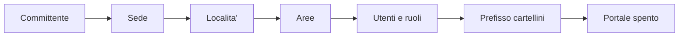
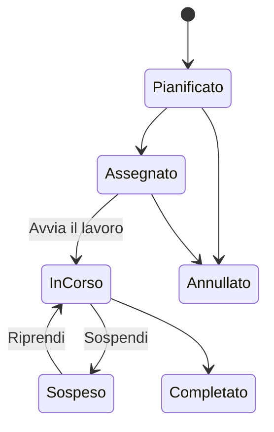

# Manuale operativo WebGIS Censimento

Versione del 17/09/2026. Copia del manuale condiviso con il committente:
le due vanno tenute allineate.

## A che cosa serve e chi fa che cosa

La piattaforma tiene il registro del verde di ogni committente: dove sta ogni albero, che cosa e', come sta, che cosa gli e' stato fatto e quando. Da quel registro escono le consegne al Comune (formati CAM), le valutazioni di stabilita', i lavori e il portale che i cittadini vedono.

Ogni persona entra con il proprio utente e vede solo quello che il suo ruolo permette. I quattro ruoli di serie:

| Ruolo | Che cosa fa | Dove lavora |
| --- | --- | --- |
| Amministratore | Tutto: crea utenti e ruoli, committenti, portali; imposta lo studio | Gestionale |
| Tecnico | Censimento, valutazioni di stabilita', territorio e lavori. Consulta il catalogo ma non lo modifica; non gestisce utenti ne' committenti | Gestionale, e l'app di campo quando esce |
| Operatore | Censisce e aggiorna le schede sul posto, vede i lavori assegnati. Non crea aree ne' ordini | App di campo (entrando, ci arriva da solo) |
| Cliente | Vede il portale riservato del proprio Comune o azienda | Portale del committente |

I ruoli si possono anche costruire su misura dalla pagina Utenti, scegliendo i permessi uno per uno. Il permesso decide che cosa si vede: chi puo' censire ma non gestire lavori entra direttamente nella schermata di campo.

## Com'e' fatta: tre indirizzi e un menu

La piattaforma risponde a tre indirizzi sullo stesso dominio, ognuno per un pubblico diverso.

| Indirizzo | Chi lo usa | A che cosa serve |
| --- | --- | --- |
| `gestionale.` + dominio | Studio: amministratore e tecnici | Tutto il lavoro d'ufficio: censimento, VTA, lavori, consegne |
| `gestionale.` + dominio + `/operatore` | Chi sta in campo | L'app di rilievo: funziona anche senza rete e si aggiunge alla schermata del telefono |
| `nomecomune.` + dominio | I cittadini | Il portale pubblico di quel Comune: mappa, scheda di ogni albero, ricerca per cartellino. Si accende Comune per Comune |

Il dominio nudo, senza prefisso, e' riservato al sito che presenta il servizio ai Comuni.

Il menu del gestionale, dall'alto in basso:

| Gruppo | Voce | In una riga |
| --- | --- | --- |
| Campo | Oggi | Il cruscotto della giornata: lavori del giorno, scadenze, ricontrolli VTA dovuti |
| Campo | Mappa | Tutto il patrimonio sulla carta; da qui si disegnano anche le aree |
| Campo | Campo (operatore) | Apre l'app di rilievo dal computer, per prova o per lavorare in ufficio con gli stessi strumenti |
| Patrimonio | Censimento | L'elenco degli elementi censiti: filtri, schede, storico, azioni su piu' schede, esportazioni |
| Patrimonio | VTA | Le valutazioni di stabilita' degli alberi, le scadenze, le perizie |
| Patrimonio | Irrigazione | Impianti e settori irrigui, letture dei contatori |
| Lavori | Lavori | Ordini di lavoro: elenco, agenda, Gantt, rendiconto, preventivi, SAL, piani pluriennali |
| Lavori | Segnalazioni | Quello che arriva dai cittadini e dai portali, da trasformare in lavori |
| Lavori | Ispezioni | Controlli con lista di verifica (aree gioco, arredi) |
| Lavori | Listini | Prezzi unitari per preventivi e SAL |
| Registri | Fitosanitari | Il registro dei trattamenti |
| Registri | Patentini | Abilitazioni delle persone e loro scadenze |
| Registri | Statistiche | I numeri del patrimonio e del lavoro fatto |
| Configurazione | Territorio | Committenti, sedi, localita', aree, vincoli: la struttura su cui poggia tutto |
| Configurazione | Catalogo | I tipi di elemento del Modello Dati ministeriale e i campi aggiuntivi |
| Configurazione | Utenti | Persone, ruoli, permessi, dati dello studio |
| Configurazione | Portale | Il portale pubblico di ogni Comune: si accende e si regola da qui |
| Configurazione | I lavori affidati | Il portale delle imprese esterne a cui si affidano lavori |

In alto a sinistra c'e' la ricerca rapida (`Ctrl+K`): si scrive un codice, una specie, una via, e si arriva alla scheda.

## Prima di partire con un Comune

Un censimento comincia in ufficio, non in strada: prima si prepara il contenitore, poi si riempie. Mezz'ora di preparazione evita giorni di correzioni.

Si legge da sinistra a destra: ogni passo poggia sul precedente.

1. **Committente** (menu Territorio, `+ Committente`): il Comune o il cliente privato, con codice, partita IVA e recapiti. Alla creazione il programma propone il **prefisso dei cartellini** (per esempio `MEN` per Mentana): e' la sigla che precede il numero di ogni elemento, `MEN-0001`, `MEN-0002`... Va deciso subito e non si cambia piu' a censimento avviato.
2. **Sede** (`+ Nuova sede`): il territorio del committente, di norma il Comune stesso con il suo codice ISTAT. Un committente grande puo' averne piu' d'una.
3. **Localita'** (`+ Nuova localita'`): le zone in cui si divide la sede: quartieri, frazioni, il capoluogo.
4. **Aree**: i singoli parchi, viali, giardini scolastici, cimiteri. Si disegnano dalla pagina Mappa, tracciando il contorno; il programma calcola la superficie da solo. Ogni elemento censito deve stare in un'area: e' l'area che dice a chi appartiene e chi la gestisce.
5. **Vincoli** (`+ Nuovo vincolo`): vincoli paesaggistici o di altro tipo che gravano su zone del territorio. Facoltativi, ma se ci sono vanno messi prima del rilievo: la scheda dell'albero li mostra da sola.
6. **Utenti e ruoli** (menu Utenti): un utente per persona, mai condivisi. Agli operatori di campo basta il ruolo Operatore: entrando finiscono direttamente nell'app di rilievo.
7. **Portale** (menu Portale): resta spento finche' il censimento non e' presentabile. Si accende con un gesto quando il Comune e' d'accordo.

Il **catalogo** dei tipi di elemento (albero, siepe, prato, panchina, gioco...) e' gia' installato: sono i 387 codici del Modello Dati ministeriale, quelli richiesti dalle consegne CAM. Non si toccano; si possono solo aggiungere campi propri o tipi personalizzati non CAM.

## Il rilievo in campo, passo per passo

Si lavora dal telefono con l'app di campo (`/operatore`), che l'operatore trova aperta appena entra. La regola e' una: si registra quello che si misura e si fotografa sul posto, mai a memoria la sera.

**La sera prima, con la rete.** Dalla scheda Sync si preme `Scarica i dati di lavoro`: il telefono si porta dietro le aree, il catalogo e gli elementi gia' censiti della zona. Da quel momento l'app lavora anche senza copertura.

**Sul posto.** La home ha quattro blocchi, uno per ciascuna cosa che si fa in campo:

| Blocco | Quando si usa | Che cosa chiede |
| --- | --- | --- |
| Nuovo albero | Una pianta non ancora censita | Posizione GPS, tipo, specie, misure, foto, cartellino |
| Misure, fotografie, cartellino, segnalazione | Un elemento gia' in archivio da aggiornare | Si cerca per codice o si inquadra il cartellino, poi si corregge |
| Ispezione di un'area | Un controllo su un'area intera (giochi, arredi) | La lista di verifica dell'area e le foto |
| Valutazione VTA | La valutazione di stabilita' di un albero | Serve la rete: si compila nel gestionale, l'app apre la scheda giusta |

**Nuovo albero, nell'ordine in cui lo chiede l'app:**

1. `Usa posizione GPS`: ci si mette accanto al fusto e si aspetta che la precisione sia buona. Se il segnale e' cattivo (sotto gli alberi capita) si sposta il punto a mano sulla mappa.
2. `Tipo oggetto`: per un albero e' sempre lo stesso tipo del catalogo (Albero, P103108). `Area`: l'app propone quella in cui ci si trova.
3. `Specie`: si cerca per nome comune o botanico. Se non si e' sicuri, meglio il solo genere che una specie sbagliata.
4. Misure: `Diametro fusto (cm)` a 1,30 m da terra, sempre a quell'altezza; `Altezza (m)`; `Diametro chioma (m)`. Sono le stesse quote per tutti gli alberi: e' quello che rende confrontabili i dati.
5. Foto: almeno una dell'intera pianta, da lontano; una del colletto o di un difetto quando c'e'. Le foto restano in coda e partono con la sincronizzazione.
6. Cartellino: si applica il cartellino fisico e si registra con `Scansiona tag` (fotocamera o lettore) oppure digitando il codice. Da quel momento chiunque inquadri il cartellino arriva alla scheda.
7. Salva. Il codice del censimento (`MEN-0001`...) lo assegna il programma alla sincronizzazione: non va inventato.

**A fine giornata.** Scheda Sync: `Operazioni in coda` dice quante registrazioni aspettano; con la rete si preme `Sincronizza ora` e si aspetta la scritta `Sincronizzato`. Le foto sono la parte lenta: meglio farlo sotto il Wi-Fi. Finche' non si e' sincronizzato, i dati stanno solo su quel telefono.

Il programma non fa da solo quello che non sa: se un dato non viene rilevato resta vuoto, e vuoto compare nelle consegne. Meglio un campo vuoto di un numero inventato.

## Dopo il rilievo, in ufficio

Il controllo in ufficio si fa nella pagina Censimento, entro pochi giorni dal rilievo, quando la memoria del posto e' ancora fresca.

**Controllare.** L'elenco si filtra per committente, area, tipo, specie, stato e data di rilievo; i filtri utili si salvano come vista con un nome. Ogni riga apre la scheda: dati, misure, foto, posizione, valutazioni, lavori collegati. Lo **storico** della scheda mostra chi ha cambiato che cosa e quando: non si perde niente, si puo' sempre risalire.

**Correggere.** Un errore su una scheda si corregge nella scheda. Un errore ripetuto su molte schede (una specie scritta male, una misura mancante da completare) si corregge con le azioni su piu' schede: si selezionano le righe, si sceglie l'azione, il programma dice prima quante schede cambierebbero e poi esegue. L'anteprima e l'esecuzione contano allo stesso modo: quello che annuncia e' quello che fa.

**Importare.** Se il Comune ha gia' un censimento in Excel o CSV, `Importa censimento` lo legge: si carica il file, si abbinano le colonne del file ai campi del programma (l'abbinamento si salva per la volta dopo), si indicano le colonne delle coordinate, si guarda l'anteprima e si conferma. Si importano anche file GeoJSON e consegne CAM di altri.

**Consegnare.** Dallo stesso elenco, con i filtri attivi, escono le esportazioni:

| Formato | A che cosa serve |
| --- | --- |
| Excel / CSV | L'elenco cosi' come si vede, per l'ufficio tecnico o per un altro programma |
| GeoJSON / Shapefile | I dati geografici per il sistema cartografico del Comune |
| Consegna CAM | Il pacchetto nei formati dei Capitolati Ambientali Minimi: codifiche ministeriali, sistema di riferimento nazionale, fotografie collegate e documento di accompagnamento |

**Cartellini.** Dalla scheda, `Cartellino QR` prepara il cartellino stampabile (formato A6) con il codice e il QR che porta alla pagina pubblica dell'elemento. La pagina pubblica si accende e si spegne elemento per elemento.

**Archivio.** Un albero abbattuto non si cancella: dalla scheda si usa `Registra abbattimento`, con la data e il motivo. Esce dagli elenchi correnti e dal portale, ma resta nel registro con tutta la sua storia. La cancellazione vera e' riservata agli errori di inserimento.

## Stabilita' (VTA) e stato degli alberi

La valutazione di stabilita' si compila nel gestionale, dalla scheda dell'albero o dalla pagina VTA, con `+ Nuova valutazione`. In campo si fa il sopralluogo con foto e appunti; la scheda si chiude in ufficio, con la rete, dove si ha tutto sotto gli occhi.

Ogni valutazione registra tre cose che poi il programma usa da solo:

| Dato | Che cosa dice | Che cosa ne fa il programma |
| --- | --- | --- |
| Classe di propensione al cedimento (A, B, C, C/D, D) | Quanto e' probabile un cedimento | Le classi C/D e D mettono l'albero "in verifica" sul portale |
| Esito (positivo, da monitorare, con prescrizioni, abbattimento) | Che cosa si e' deciso | Le prescrizioni lo segnano "da potare"; il monitoraggio "in cura"; l'abbattimento "in verifica" finche' l'ente non decide |
| Data della prossima verifica | Quando si torna a guardarlo | Compare nel cruscotto Oggi e nella pagina VTA fra i ricontrolli in scadenza |

**Ricontrolli.** Dalla pagina VTA, `Metti in agenda i ricontrolli dovuti` crea un ordine di lavoro per ogni albero con la verifica scaduta o in scadenza, senza doppioni anche se lo si preme due volte. Da li' il ricontrollo entra nell'agenda dei lavori come qualunque altro intervento.

**Perizia.** Da ogni valutazione esce la perizia di stabilita' in PDF, con le fotografie dell'albero e il numero di protocollo. Una perizia validata si congela: ristampata fra un anno e' identica, foto comprese.

**Lo stato che vedono i cittadini** non si scrive a mano. Nasce dall'ultima valutazione e dai lavori aperti, sempre con la stessa regola: sano, in cura, da potare, in verifica. Cambia da solo quando si chiude un lavoro o si registra una nuova valutazione. In pubblico non compare mai la parola "abbattimento" prima che l'ente abbia deciso.

## Lavori e portale del Comune, in breve

**I lavori** (menu Lavori) seguono sempre lo stesso percorso: si crea l'ordine (`Nuovo ordine`), lo si assegna a una squadra o a un'impresa esterna, la squadra lo avvia dall'app di campo, lo sospende se serve, lo chiude con il consuntivo. Ogni ordine e' collegato agli elementi su cui si lavora: chiuso l'ordine, la storia dell'albero si aggiorna da sola.

Gli stessi ordini si guardano in cinque modi dalla stessa pagina: Elenco, Agenda (per giorno), Gantt (su una linea del tempo, per squadra o committente), Rendiconto (che cosa e' stato fatto e quanto vale) e SAL per la contabilita'. I preventivi e i piani pluriennali stanno accanto, e da un piano approvato gli ordini si generano in blocco.

**Il portale del Comune** (menu Portale) e' il sito che i cittadini vedono. Si prepara e si accende in quattro mosse:

1. Si sceglie il committente e si compila il profilo: nome da mostrare, indirizzo (`nomecomune.` + dominio), colore dell'ente, stemma, testo di benvenuto, email a cui i cittadini scrivono le segnalazioni, titolare del trattamento per l'informativa.
2. Si decide che cosa esce. Di serie **non esce niente da solo**: ogni ordine di lavoro, perizia e vincolo ha il proprio interruttore "pubblico"; le stime ambientali (CO2 e, separatamente, ossigeno, polveri e pioggia) hanno i loro interruttori, spenti di partenza. I singoli alberi si possono nascondere. Le note interne e le foto dei difetti non escono mai.
3. Si accende. Da quel momento il portale risponde al suo indirizzo, senza cookie e senza banner.
4. Si stampano i cartellini con il QR: il cittadino inquadra il cartellino, o scrive il numero nel portale, e legge la scheda della pianta.

Sul portale il cittadino trova la mappa del verde, la scheda di ogni albero (specie, misure, stato, interventi pubblici), la ricerca per numero di cartellino e le indicazioni per segnalare un problema. I numeri in prima pagina si aggiornano da soli con il censimento.

## Regole d'oro e che cosa fare se qualcosa non va

Le dieci regole che tengono in piedi un censimento, da appendere in furgone:

1. Prima il territorio, poi il rilievo: nessun elemento fuori da un'area.
2. Il prefisso dei cartellini si decide una volta e non si tocca piu'.
3. Scaricare i dati di lavoro la sera prima, con il Wi-Fi.
4. Il diametro del fusto si misura a 1,30 m da terra, sempre.
5. Almeno una foto intera per ogni pianta, scattata dal telefono con l'app, non con la fotocamera del telefono: cosi' finisce nella scheda giusta.
6. Cartellino applicato e registrato prima di passare alla pianta dopo.
7. Sincronizzare a fine giornata e aspettare la scritta "Sincronizzato": finche' non compare, i dati stanno solo su quel telefono.
8. Un dato che non si e' misurato resta vuoto: mai stime scritte come misure.
9. Un albero abbattuto si registra come abbattuto, non si cancella.
10. Il portale si accende solo quando il censimento e' presentabile e il Comune e' d'accordo.

**Se qualcosa non va.** Il programma non fallisce in silenzio: quando un caricamento non riesce compare un avviso rosso con il numero dell'errore (per esempio "Dati non caricati (errore 404). Riprova"). Quel numero e' la cosa piu' utile da mandare a chi fa assistenza, insieme a una schermata e alla pagina in cui e' successo.

| Sintomo | Prima cosa da fare |
| --- | --- |
| Avviso rosso con un numero | Premere `Riprova`; se torna, schermata e numero all'assistenza |
| L'app di campo dice che non c'e' rete | Continuare a lavorare: tutto va in coda e parte alla prossima sincronizzazione |
| "Modello non piu' disponibile sul dispositivo" | Sincronizzare e riscaricare i dati di lavoro |
| Un dato salvato in ufficio non si vede sul telefono | Sul telefono, scheda Sync, `Sincronizza ora` |
| Il portale del Comune non mostra un elemento | Controllare che non sia nascosto, archiviato o senza data di rilievo valida |
| Pagine strane dopo un aggiornamento del server | Ricaricare con `Ctrl+F5`; se resta, rilanciare l'aggiornamento sul server |

Per l'aggiornamento del server e i problemi di installazione c'e' la guida di installazione (`docs/DEPLOY-ARUBA.md`), con il comando di diagnosi che stampa lo stato del server in italiano.
