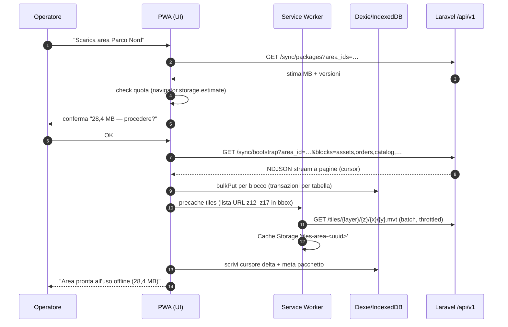
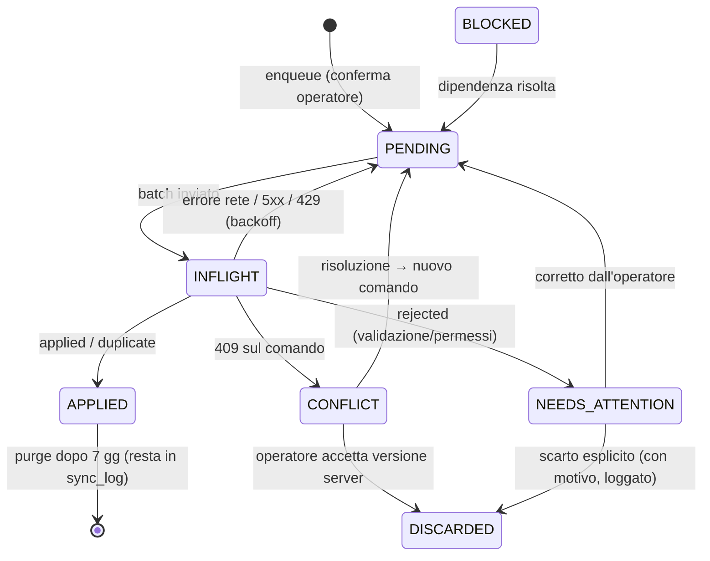
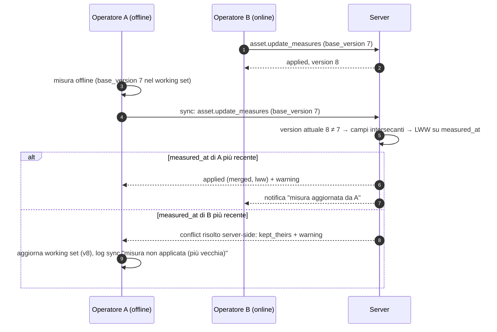
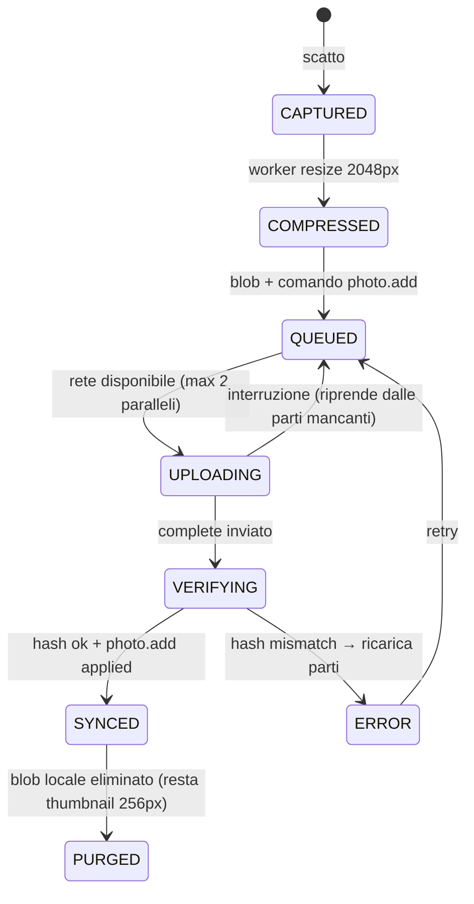

# OFFLINE-SYNC.md — Design della sincronizzazione offline della PWA Operatore

| | |
|---|---|
| **Progetto** | Piattaforma WebGIS gestione del verde |
| **Fase** | 0 — Documenti di progettazione |
| **Espande** | `PROPOSTA-ARCHITETTURA.md` §11 (Strategia offline), con riferimenti a §6, §9, §10, §12, §13 |
| **Requisiti coperti** | M02 (offline completo), M01/M03/M04 (PWA operatore), X06 (modalità squadra), X07 (pacchetti offline per area), R02 (foto), R16 (audit), R23 (tracciabilità) |
| **Stato** | Bozza per revisione — Fase 0 |
| **Data** | 2026-08-10 |

---

## Indice

1. [Principi di progettazione](#1-principi-di-progettazione)
2. [Working set: cosa si scarica](#2-working-set-cosa-si-scarica)
3. [Schema locale IndexedDB / Dexie](#3-schema-locale-indexeddb--dexie)
4. [Coda comandi](#4-coda-comandi)
5. [Contratto API `/api/v1/sync`](#5-contratto-api-apiv1sync)
6. [Conflict resolution](#6-conflict-resolution)
7. [Foto: compressione, upload chunked, stati](#7-foto-compressione-upload-chunked-stati)
8. [UX: indicatore di stato e log sync](#8-ux-indicatore-di-stato-e-log-sync)
9. [Sicurezza offline](#9-sicurezza-offline)
10. [Limiti dichiarati e casi degeneri](#10-limiti-dichiarati-e-casi-degeneri)
11. [Piano di test](#11-piano-di-test)
12. [Appendice A — Codici errore](#appendice-a--codici-errore)
13. [Appendice B — Glossario](#appendice-b--glossario)

---

## 1. Principi di progettazione

### 1.1 Offline-first **solo** sulla PWA operatore

L'offline è un requisito della **PWA operatore** (Vue 3 + Workbox + Dexie), non del backoffice:

- **Backoffice web (Inertia)**: richiede rete. Nessuna coda locale, nessun dato in IndexedDB oltre
  alla cache HTTP standard. Semplifica drasticamente il problema: un solo client scrive offline.
- **PWA operatore**: progettata per funzionare **senza rete per un'intera giornata di lavoro**
  (censimento, schede, foto, checklist, apertura/chiusura ODL, scan barcode/QR/NFC). La rete è
  un'ottimizzazione, non un prerequisito: ogni flusso di campo deve completarsi al 100% offline.
- **Portale cliente / pubblico**: solo online.

Conseguenza architetturale: il server resta **source of truth**; il client detiene una **replica
parziale e temporanea** (working set, §2) più una **coda di comandi** in uscita (§4). Non esiste
sincronizzazione peer-to-peer tra device: tutto passa dal server.

### 1.2 UUID generati client-side

Ogni entità creata offline (asset, foto, ispezione, consuntivo, tag association…) nasce con
**UUID v7** generato sul device (`crypto.randomUUID()` non genera v7: si usa una funzione dedicata
~20 righe, oppure la libreria `uuidv7`). Motivi della scelta v7 rispetto a v4:

- **niente rimappaggio di ID**: l'ID locale è l'ID definitivo; le FK create offline
  (foto→asset, consuntivo→ODL) sono già corrette e non vanno riscritte dopo la sync;
- **ordinabilità temporale**: il prefisso timestamp del v7 rende gli indici B-tree di PostgreSQL
  quasi-append (meno page split rispetto a v4 random) e facilita il debug;
- **collisioni**: probabilità trascurabile (74 bit random per millisecondo); in ogni caso il
  server tratta una collisione di PK come errore `rejected` (Appendice A) e la segnala, non
  sovrascrive mai.

Regola: **il server non genera mai un ID alternativo per un oggetto creato dal client**; accetta
l'UUID proposto o rifiuta il comando. `id` server-side è `uuid PRIMARY KEY` (estensione
`uuid-ossp` / funzioni native PG16), coerente con il modello ER di §9 della proposta.

### 1.3 Scritture come comandi idempotenti

Ogni azione offline non modifica "record" ma accoda un **comando** (event-command sourcing
lato client):

- il comando descrive **l'intenzione** (`asset.create`, `work_order.close`,
  `inspection.submit`…), non lo stato finale del record;
- ogni comando porta una **`idempotency_key`** (UUID v4) univoca: il server la registra in
  `sync_operations` con vincolo `UNIQUE (tenant_id, idempotency_key)`; un replay (retry dopo
  timeout, batch duplicato) restituisce **l'esito originale memorizzato**, senza riapplicare;
- l'applicazione di un comando è **transazionale** (tutto o niente) e produce audit log (R16);
- i comandi sono **piccoli e mirati** (patch di campi, non dump dell'intero record): riduce la
  superficie di conflitto (§6) e la banda.

### 1.4 Altri principi vincolanti

| # | Principio | Conseguenza |
|---|---|---|
| P1 | **Nessuna perdita silenziosa** (§44 esteso alla sync) | Un comando esce dalla coda solo con esito `applied`/`duplicate`, o con presa visione esplicita dell'utente (conflitto/rifiuto). Mai scartato in automatico. |
| P2 | **Server source of truth** | Il client non "vince" mai da solo: ogni scrittura è validata server-side (RBAC, tenancy, regole catalogo). L'offline non bypassa alcun permesso. |
| P3 | **Append-only dove possibile** | Foto, consuntivi, letture NFC, risposte checklist inviate: modellati come inserimenti, mai update concorrenti → l'80% dei conflitti sparisce per costruzione (§6). |
| P4 | **Tempo del server autorevole** | `client_ts` è informativo ("misurato il"); ordering e audit usano il tempo server. Gestione clock skew in §10.3. |
| P5 | **Downgrade progressivo, mai blocco** | Se manca un pezzo di working set (es. tile non scaricate) la PWA degrada (mappa grigia con soli overlay) ma i flussi dati restano operativi. |
| P6 | **Un utente autenticato per device alla volta** | Cambio utente = chiusura sessione locale; la coda dell'utente precedente resta cifrata e viene sincronizzata al suo prossimo login (§9.5). Il tag NFC non è mai autenticazione (§40 proposta). |

---

## 2. Working set: cosa si scarica

### 2.1 Contenuto del working set

Al login — e su comando esplicito **"Scarica area"** — la PWA scarica in IndexedDB il *working
set*, delimitato per **area operativa** (entità `areas` del modello ER) e per **assegnazioni
dell'operatore/squadra**:

| Blocco | Contenuto | Filtro | Aggiornamento |
|---|---|---|---|
| **Lavori assegnati** | ODL (work_orders) assegnati all'operatore o alla sua squadra, con oggetti collegati (`work_order_assets`), note, rischi, DPI, ultimo intervento per asset | `team_id` / `assignee`, stato ∈ {PIANIFICATO, IN_CORSO, SOSPESO}, finestra ±14 gg | pull delta ad ogni sync |
| **Asset dell'area** | Tutti gli asset delle aree scaricate: id, codice censimento, tipo catalogo, stato, attributi (JSONB), **geometrie semplificate**, tag fisici associati, flag "ha foto/documenti" (senza i binari) | `area_id IN (aree scaricate)` | pull delta |
| **Specializzazioni** | `trees` (tassonomia + dendrometria), `planting_sites`, componenti irrigazione dell'area, schede aree gioco | idem | pull delta |
| **Cataloghi** | `catalog_main_types`/`sub_types`/`object_types` (seed MD v2.1 + fork tenant), `custom_fields` con regole di validazione, liste valori | intero tenant | versione catalogo (ETag) |
| **Checklist** | `inspection_templates` + `checklist_items` attivi | intero tenant | versione |
| **Listini minimi** | `work_types` (lavorazioni: codice, UdM, durata std) + voci di listino dei **contratti attivi sulle aree scaricate** (solo codice, descrizione, UdM, prezzo) — servono per consuntivare quantità, non per fare computi | contratti attivi | versione |
| **Anagrafiche di contorno** | Squadra, colleghi (per modalità squadra X06), mezzi/attrezzature assegnati, motivi di sospensione, causali foto | tenant/squadra | versione |
| **Tile cartografiche** | v. §2.3 | bbox aree | manuale/scadenza |

**Espressamente esclusi dal working set** (consultabili solo online): documenti PDF/DOCX,
originali foto storiche (si scaricano on-demand le thumbnail se online), storico completo
versioni, dati economici oltre il listino minimo, dati di altri clienti/aree, VTA storiche
complete (si include solo `next_check_due`, ultima classe di propensione e prescrizioni aperte
per ciascun albero).

### 2.2 Pacchetti per area con stima dimensioni (X07)

Il download è organizzato in **pacchetti per area**: la UI mostra l'elenco delle aree su cui
l'operatore ha lavori o permessi, con **stima MB prima del download** e stato di freschezza.

Endpoint di stima:

```
GET /api/v1/sync/packages?area_ids=…
```

```json
{
  "packages": [
    {
      "area_id": "0198b2f0-4a11-7cc3-9f30-1d2e3f405060",
      "area_name": "Parco Nord — Settore A",
      "assets_count": 4210,
      "estimated": {
        "data_mb": 6.4,
        "tiles_mb": 22.0,
        "total_mb": 28.4
      },
      "catalog_version": "md-2.1-t42-r7",
      "last_downloaded_at": "2026-08-09T05:12:00Z",
      "stale": false
    }
  ],
  "shared_blocks": { "catalog_mb": 0.9, "checklists_mb": 0.2, "pricelists_mb": 0.1 }
}
```

**Stime dimensionali di riferimento** (da validare in Fase 3 con dati reali; assunzioni: JSON
compresso in transito con gzip/brotli ~4:1, dimensioni **a riposo** in IndexedDB non compresse):

| Voce | Unità | Stima a riposo | Esempio area tipo (4.000 asset, 2 km²) |
|---|---|---|---|
| Asset puntuale (albero, gioco, arredo) | record | 0,6–1,0 KB | 3.000 × 0,8 KB ≈ 2,4 MB |
| Asset lineare/poligonale con geometria semplificata | record | 1,5–4 KB | 1.000 × 2,5 KB ≈ 2,5 MB |
| Scheda `trees` aggiuntiva | record | 0,4 KB | 2.500 × 0,4 KB ≈ 1,0 MB |
| ODL con oggetti collegati | record | 2–4 KB | 60 × 3 KB ≈ 0,2 MB |
| Catalogo completo MD + custom fields | tenant | 0,8–1,2 MB | 1,0 MB |
| Template checklist | tenant | 0,1–0,3 MB | 0,2 MB |
| Listino minimo (300 voci) | contratto | ~0,1 MB | 0,1 MB |
| **Totale dati (senza tile)** | | | **≈ 7–8 MB** |
| Tile vettoriali offline (§2.3) | area | 10–40 MB | ≈ 22 MB |
| **Totale pacchetto** | | | **≈ 30 MB** |

Ordine di grandezza: **un territorio comunale medio (20–30.000 asset, 5–8 aree) sta in
150–300 MB**, compatibile con smartphone consumer e Zebra rugged (quota IndexedDB tipica:
fino al 60% del disco libero su Chrome/Android). Guard-rail su quota in §10.1.

### 2.3 Geometrie semplificate

Nel working set le geometrie viaggiano **semplificate** per contenere peso e memoria:

- **punti**: coordinate piene (nessuna semplificazione), arrotondate a 6 decimali (~11 cm);
- **linee/poligoni**: `ST_SimplifyPreserveTopology(geom, 0.000005)` (~0,5 m) calcolata
  server-side alla generazione del pacchetto, più `bbox` precalcolata per hit-test locale;
- la geometria **piena resta solo sul server**; il flag `geom_simplified: true` accompagna il
  record locale;
- **editing geometrico offline**: consentito su punti (spostamento, nuovo rilievo GPS) e sul
  **disegno di nuove** linee/poligoni; la **modifica di vertici** di una geometria esistente
  semplificata è disabilitata offline (il client non ha i vertici veri) — l'operatore può invece
  ridisegnarla integralmente, e il comando è marcato `geometry_redraw: true` e passa sempre
  dalla risoluzione manuale (§6.2) se nel frattempo la geometria server è cambiata.

### 2.4 Strategia tile offline

- **Formato**: vector tiles MVT dagli stessi endpoint `ST_AsMVT` usati online (stile MapLibre
  identico online/offline) + un **basemap vettoriale leggero** di contesto (strade/edifici/idro
  da estratto OpenMapTiles del comune) servito dal nostro server per non dipendere da terze
  parti in campo. Niente basemap raster satellitare offline (peso proibitivo): la foto aerea è
  solo online.
- **Copertura**: bbox dell'area (+ buffer 300 m), zoom **z12→z17** per i layer asset,
  z12→z16 per il basemap. Oltre z17 MapLibre fa **overzoom** dei tile z17 (accettabile per
  editing di campo, i dati vettoriali restano nitidi).
- **Stima**: per un'area di 2 km²: ~350 tile asset (media 25–45 KB) + ~500 tile basemap
  (media 20 KB) ≈ **15–30 MB**. La stima esposta da `/sync/packages` è calcolata con conteggio
  reale dei tile in bbox × dimensione media misurata per zoom.
- **Storage**: Cache Storage (`caches.open('tiles-area-<uuid>')`) gestita da Workbox con
  plugin custom: una cache **per area**, così l'eliminazione del pacchetto è `caches.delete()`
  atomica. In Dexie resta solo l'indice (`tile_packages`) con conteggi, bytes e scadenza.
- **Runtime**: strategia `CacheFirst` con fallback rete; online i tile asset usano
  `StaleWhileRevalidate` con invalidazione via header `ETag` legato alla versione dati
  dell'area (coerente con l'invalidazione Redis per bbox di §10 proposta).
- **Refresh**: i tile asset del pacchetto vengono rigenerati e riscaricati solo su richiesta
  ("Aggiorna area") o quando il pull delta segnala più di N geometrie cambiate nell'area
  (default N=50); il basemap ha scadenza 90 giorni.

### 2.5 Sequenza di download pacchetto



Il bootstrap è **ripristinabile**: ogni blocco ha un cursore; se il download si interrompe
riparte dal blocco/pagina successiva, non da zero. Fino a completamento il pacchetto è marcato
`partial: true` e la UI lo segnala.

---

## 3. Schema locale IndexedDB / Dexie

### 3.1 Database e tabelle

Un database Dexie **per tenant+utente**: `wg_<tenantShort>_<userShort>` (evita mescolanze in
caso di device condiviso, §9.5). Schema v1:

```ts
// db.ts — Dexie 4.x
import Dexie, { type Table } from 'dexie';

export class FieldDB extends Dexie {
  // dichiarazioni Table<T, Key> omesse per brevità
  constructor(name: string) {
    super(name);

    this.version(1).stores({
      // --- meta / infra ---
      meta:            '&key',                                  // kv: cursors, versions, device, flags
      areas:           '&id, name, stale',
      tile_packages:   '&area_id, expires_at',

      // --- working set (replica read-mostly) ---
      assets:          '&id, area_id, object_type_id, census_code, status, [area_id+object_type_id], updated_at',
      trees:           '&asset_id, species, next_check_due',
      work_orders:     '&id, status, planned_date, team_id, [status+planned_date]',
      wo_assets:       '&[work_order_id+asset_id], work_order_id, asset_id',
      asset_tags:      '&id, asset_id, uid, type',              // lookup scan/NFC → asset
      catalog_types:   '&id, code, parent_id, kind',
      custom_fields:   '&id, object_type_id',
      checklists:      '&id, target_kind, active',
      work_types:      '&id, code',
      price_items:     '&id, contract_id, work_type_id',
      team:            '&id, kind',                             // membri, mezzi, attrezzature

      // --- scritture locali ---
      sync_queue:      '&idempotency_key, device_seq, status, entity_id, [status+device_seq]',
      drafts:          '&id, entity_kind, updated_at',          // bozze non ancora "commit" in coda
      photo_blobs:     '&photo_id',                             // Blob compressi
      photo_uploads:   '&photo_id, status, [status+created_at]',// stato upload chunked
      conflicts:       '&idempotency_key, entity_id, resolved',
      sync_log:        '++seq, ts, level'                       // log consultabile (ring buffer 2000)
    });
  }
}
```

Note di progetto:

- **chiavi**: PK = UUID applicativo (mai auto-increment, tranne `sync_log`); indici composti
  (`[status+device_seq]`) per drenare la coda in ordine con un solo `where`;
- **`assets.attributes`** (JSONB custom fields) e le geometrie GeoJSON sono campi non
  indicizzati del record (Dexie indicizza solo ciò che è dichiarato: il resto costa zero);
- **hit-test mappa offline**: selezione per `area_id` + filtro bbox in memoria (i volumi per
  area, ≤ ~10k feature, lo consentono); nessun indice spaziale locale in v1 — se servisse, si
  aggiunge una colonna geohash a 7 caratteri come indice (migrazione v2 già prevista);
- **`drafts` vs `sync_queue`**: una scheda in compilazione vive in `drafts` (salvataggio
  continuo, riapribile); solo alla conferma dell'operatore diventa uno o più comandi in
  `sync_queue`. La coda contiene esclusivamente intenzioni **complete e valide** rispetto alle
  regole del catalogo locale;
- **`photo_blobs` separata** da `photo_uploads`: i Blob pesanti stanno in una tabella senza
  altri campi, così le scansioni della coda non caricano i binari.

### 3.2 Versioning dello schema locale

- Ogni evoluzione = `this.version(n).stores({...}).upgrade(tx => …)`; Dexie applica le
  migrazioni in sequenza all'apertura. Regole:
  1. **mai** rimuovere una tabella che può contenere comandi non sincronizzati; le migrazioni
     che toccano `sync_queue`/`photo_*` devono essere **loss-less** e testate (§11.1);
  2. le migrazioni dei dati di working set possono essere distruttive (si ri-scarica il
     pacchetto): in tal caso l'upgrade marca le aree `stale` invece di trasformare i dati;
  3. la **versione dello schema locale richiesta** è pubblicata dal server
     (`min_client_schema` nella risposta di sync): un client troppo vecchio riceve
     `426 UPGRADE_REQUIRED` sulla sync → il service worker aggiorna la PWA (skipWaiting su
     conferma utente) **ma la coda esistente viene sempre drenata prima** con il vecchio
     formato, oppure migrata dal codice nuovo (la coda ha un proprio campo `schema: 1` per
     comando, così il server accetta N-1 versioni di payload);
  4. downgrade non supportato: `Dexie.SchemaError` all'apertura con versione minore →
     schermata "aggiorna l'app".

### 3.3 Chi scrive cosa

| Tabella | Scrive il client | Scrive la sync (pull) |
|---|---|---|
| working set (`assets`, `work_orders`, …) | mai direttamente (solo **apply ottimistico** locale di comandi accodati, marcato `dirty`) | sì: upsert da delta + tombstone |
| `sync_queue`, `drafts`, `photo_*` | sì | solo cambio `status` a esito sync |
| `conflicts`, `sync_log`, `meta` | sì | sì |

L'**apply ottimistico** aggiorna la copia locale dell'entità appena il comando entra in coda
(l'operatore vede subito il suo lavoro); il campo `dirty: true` + `pending_ops: [keys]`
sull'entità consente alla UI di mostrarne lo stato e al pull delta di **non sovrascrivere** un
record con modifiche locali pendenti (il delta viene bufferizzato e applicato dopo l'esito
dei comandi, o gestito come conflitto).

---

## 4. Coda comandi

### 4.1 Struttura del comando

```json
{
  "idempotency_key": "7f9c2f5e-9b1d-4a53-a1c4-2f6f3f9e77aa",
  "device_seq": 143,
  "type": "asset.update_measures",
  "schema": 1,
  "entity_id": "0198b301-6a2e-7d10-8f4b-aa10bb20cc30",
  "base_version": 7,
  "payload": {
    "height_m": 14.5,
    "dbh_cm": 62,
    "crown_diam_m": 9.0,
    "measured_at": "2026-08-10T08:41:12+02:00"
  },
  "geom": null,
  "client_ts": "2026-08-10T08:41:30+02:00",
  "device_id": "dev-0198aefc-3c21-7e55-b2d1-556677889900",
  "actor": { "user_id": "…", "on_behalf_of": null },
  "depends_on": [],
  "status": "PENDING",
  "attempts": 0,
  "last_error": null
}
```

Campi chiave:

- **`idempotency_key`** — UUID v4, identifica *questa* intenzione; usato dal server per il
  replay-safe (§1.3) e dal client come PK della coda.
- **`device_seq`** — contatore monotono per device (persistito in `meta`), definisce l'ordine
  **totale locale**; mai riusato, sopravvive a restart.
- **`type`** — dizionario chiuso versionato (v. §4.2).
- **`entity_id`** — UUID dell'entità target (per i `*.create` è l'UUID appena generato).
- **`base_version`** — versione dell'entità che il client vedeva quando ha deciso il comando
  (optimistic locking, §6.1). Assente sui comandi append-only.
- **`payload`** — solo i campi toccati (patch semantics).
- **`geom`** — GeoJSON (WGS84) se il comando tocca la geometria; separato dal payload perché
  segue regole di conflitto proprie (§6.2) e può includere `gps_accuracy_m`, `survey_method`.
- **`client_ts`** — orologio del device con offset TZ; informativo (P4).
- **`device_id`** — identità del device registrata al provisioning (§9.4).
- **`actor.on_behalf_of`** — per la modalità squadra (X06): il caposquadra consuntiva per un
  collega; il server verifica il permesso `team.log_for_members`.
- **`depends_on`** — idempotency_key di comandi che DEVONO risultare applicati prima
  (di regola vuoto: l'ordine FIFO basta; usato per dipendenze esplicite cross-entità,
  es. `photo.attach` → `asset.create`).

### 4.2 Dizionario dei tipi di comando (v1)

| Tipo | Append-only | `base_version` | Note |
|---|---|---|---|
| `asset.create` | sì (insert) | — | include `geom` obbligatoria, `object_type_id`, attributi |
| `asset.update_attrs` | no | sì | patch attributi/campi custom |
| `asset.update_measures` | no | sì | dendrometria alberi (LWW con warning, §6.2) |
| `asset.update_geom` | no | sì | v. §2.3 e §6.2 |
| `asset.change_status` | no | sì | macchina a stati (es. ABBATTUTO, R18) |
| `tag.associate` / `tag.dissociate` | sì (evento) | — | scan/NFC; storicizzato, audit §59 |
| `photo.add` | sì | — | metadati; il binario viaggia sul canale upload (§7) |
| `work_order.start` / `.pause` / `.resume` / `.close` | sì (transizione) | sì (sullo stato) | transizioni validate dalla state machine server |
| `work_log.add` | sì | — | consuntivo: ore, quantità, mezzi, materiali, firma |
| `inspection.submit` | sì | — | risposte checklist complete + esito |
| `issue.create` | sì | — | segnalazione dal campo |
| `nfc.write_receipt` | sì | — | ricevuta di scrittura tag (uid, payload, esito) |

Il dizionario è **chiuso**: un tipo sconosciuto al server → `rejected:UNKNOWN_TYPE` (mai
scartato in silenzio; resta in coda `NEEDS_ATTENTION`, tipicamente indica client da
aggiornare).

### 4.3 Ordinamento causale

1. **Intra-device**: la coda è FIFO per `device_seq`; il batch di sync preserva l'ordine e il
   server applica i comandi del batch **in sequenza** (stessa transazione? no: una transazione
   *per comando*, così un fallimento non annulla i precedenti — v. §5.2).
2. **Causalità implicita**: FIFO garantisce che `asset.create` preceda ogni comando sullo
   stesso asset generato dopo, perché generato dopo. È la garanzia sufficiente per il 95% dei
   casi.
3. **Causalità esplicita (`depends_on`)**: per dipendenze cross-entità non catturate dal FIFO
   (es. comando generato da riordino manuale della coda dopo un errore). Se una dipendenza è
   in stato `rejected`/`NEEDS_ATTENTION`, i dipendenti passano a `BLOCKED` e la UI li mostra
   raggruppati sotto la causa (P1: nulla si perde).
4. **Inter-device**: nessun ordine garantito tra device diversi; è compito dell'optimistic
   locking + matrice conflitti (§6). L'ordinamento inter-device NON usa `client_ts`
   (clock skew, §10.3) ma l'ordine di arrivo al server + `version`.

### 4.4 Ciclo di vita e retry



**Trigger di sync** (in ordine): evento `online`, `visibilitychange→visible`, timer periodico
(60 s se coda non vuota), Background Sync API (best effort su Chrome/Android), WorkManager nel
wrapper Zebra (garantito, §12 proposta), pulsante manuale "Sincronizza ora".

**Retry con backoff esponenziale + jitter** (solo per errori *ritentabili*: rete, timeout,
502/503/504, 429 con rispetto di `Retry-After`):

```
delay = min(15 min, 5 s × 2^attempts) × random(0.8 … 1.2)
```

- errori **non ritentabili**: 400/422 (comando malformato → `NEEDS_ATTENTION`),
  401 (→ refresh token, poi retry immediato una volta), 403 `DEVICE_REVOKED` (→ §9.4),
  409 (→ flusso conflitti), 413 (→ split del batch a metà, ricorsivo);
- il contatore `attempts` è per comando ma il backoff è **per canale** (non si martella il
  server con N backoff indipendenti);
- dopo 50 tentativi falliti il canale resta in retry ma la UI alza un avviso persistente
  ("impossibile sincronizzare da 3 ore — verifica la connessione").

---

## 5. Contratto API `/api/v1/sync`

### 5.1 Endpoint

| Metodo | Path | Scopo |
|---|---|---|
| `GET` | `/api/v1/sync/packages` | stima pacchetti per area (§2.2) |
| `GET` | `/api/v1/sync/bootstrap` | download iniziale working set (NDJSON paginato, `cursor`) |
| `GET` | `/api/v1/sync/changes?cursor=…&areas=…` | **pull delta**: record cambiati + tombstone dal cursore |
| `POST` | `/api/v1/sync/batch` | **push**: applica un batch di comandi |
| `POST` | `/api/v1/uploads` (+ `/parts`, `/complete`) | canale foto (§7) |
| `GET` | `/api/v1/sync/devices` / `POST …/revoke` | registry device (§9.4, backoffice) |

Tutte autenticate (Sanctum, scope `pwa:sync`), tenancy da token, rate-limit dedicato.

### 5.2 Push batch — semantica

- Max **200 comandi o 1 MB** per batch (il client spezza automaticamente); le foto NON
  passano di qui (solo i metadati `photo.add`).
- Il server processa i comandi **in ordine**, ognuno nella propria transazione DB; registra
  ogni esito in `sync_operations` (tabella già prevista nel modello ER §9).
- La risposta HTTP è **200 anche in presenza di esiti misti**: l'esito è *per comando*.
  Gli errori HTTP (401/403/413/422/429/5xx) riguardano l'**envelope**, non i comandi.
- Un batch reinviato identico (stesse `idempotency_key`) produce gli stessi esiti
  (`duplicate` con l'esito originale incapsulato).

**Request:**

```json
POST /api/v1/sync/batch
Authorization: Bearer <access_token>
Content-Type: application/json

{
  "batch_id": "b3c1f6d2-77aa-4a10-9e0c-101112131415",
  "device_id": "dev-0198aefc-3c21-7e55-b2d1-556677889900",
  "app_version": "1.4.2",
  "schema": 1,
  "client_time": "2026-08-10T16:02:11+02:00",
  "commands": [
    {
      "idempotency_key": "7f9c2f5e-9b1d-4a53-a1c4-2f6f3f9e77aa",
      "device_seq": 143,
      "type": "asset.create",
      "entity_id": "0198b301-6a2e-7d10-8f4b-aa10bb20cc30",
      "payload": {
        "area_id": "0198b2f0-4a11-7cc3-9f30-1d2e3f405060",
        "object_type_id": "P1-ALB-001",
        "attributes": { "specie": "Tilia cordata", "note": "nuovo impianto" }
      },
      "geom": {
        "type": "Point",
        "coordinates": [12.56637, 44.06012],
        "properties": { "gps_accuracy_m": 2.1, "survey_method": "GPS_SMARTPHONE" }
      },
      "client_ts": "2026-08-10T08:35:02+02:00"
    },
    {
      "idempotency_key": "9a11cc0d-1e2f-4b6a-8899-aabbccddeeff",
      "device_seq": 144,
      "type": "asset.update_measures",
      "entity_id": "0198a0aa-1234-7bcd-9e0f-102030405060",
      "base_version": 7,
      "payload": { "height_m": 14.5, "dbh_cm": 62, "measured_at": "2026-08-10T08:41:12+02:00" },
      "client_ts": "2026-08-10T08:41:30+02:00"
    },
    {
      "idempotency_key": "c0ffee00-4321-4d5e-8f90-a1b2c3d4e5f6",
      "device_seq": 145,
      "type": "work_order.close",
      "entity_id": "0198b2aa-9d10-7e21-b3c4-556677001122",
      "base_version": 3,
      "payload": { "closed_note": "Completato", "signature_ref": "ph-0198b3aa…" },
      "client_ts": "2026-08-10T11:58:00+02:00"
    }
  ]
}
```

**Response (esiti misti):**

```json
HTTP/1.1 200 OK

{
  "batch_id": "b3c1f6d2-77aa-4a10-9e0c-101112131415",
  "server_time": "2026-08-10T14:02:14Z",
  "min_client_schema": 1,
  "results": [
    {
      "idempotency_key": "7f9c2f5e-9b1d-4a53-a1c4-2f6f3f9e77aa",
      "status": "applied",
      "entity_id": "0198b301-6a2e-7d10-8f4b-aa10bb20cc30",
      "version": 1,
      "audit_id": "al-99887766"
    },
    {
      "idempotency_key": "9a11cc0d-1e2f-4b6a-8899-aabbccddeeff",
      "status": "conflict",
      "code": "VERSION_MISMATCH",
      "entity_id": "0198a0aa-1234-7bcd-9e0f-102030405060",
      "resolution_hint": "lww_warning",
      "yours": {
        "base_version": 7,
        "payload": { "height_m": 14.5, "dbh_cm": 62, "measured_at": "2026-08-10T08:41:12+02:00" }
      },
      "theirs": {
        "version": 9,
        "updated_by": "m.rossi",
        "updated_at": "2026-08-10T09:15:44Z",
        "fields": { "height_m": 14.2, "dbh_cm": 62, "measured_at": "2026-08-10T09:15:00+02:00" }
      }
    },
    {
      "idempotency_key": "c0ffee00-4321-4d5e-8f90-a1b2c3d4e5f6",
      "status": "rejected",
      "code": "INVALID_TRANSITION",
      "message": "L'ODL è in stato ANNULLATO: chiusura non ammessa.",
      "entity": { "id": "0198b2aa-9d10-7e21-b3c4-556677001122", "status": "ANNULLATO", "version": 5 }
    }
  ]
}
```

Esiti possibili per comando: `applied`, `duplicate` (replay: incapsula l'esito originale),
`conflict` (con `yours`/`theirs` e `resolution_hint`), `rejected` (validazione, permessi,
transizione illegale), `failed_dependency` (un `depends_on` non applicato), `error`
(errore interno ritentabile su quel comando). Codici in Appendice A.

### 5.3 Pull delta

```json
GET /api/v1/sync/changes?cursor=chg:000000018452&areas=0198b2f0-…

{
  "cursor": "chg:000000019011",
  "server_time": "2026-08-10T14:02:20Z",
  "changes": [
    { "op": "upsert", "table": "assets", "row": { "id": "…", "version": 9, "…": "…" } },
    { "op": "upsert", "table": "work_orders", "row": { "id": "…", "version": 4, "status": "ASSEGNATO" } },
    { "op": "delete", "table": "assets", "id": "0198aa…", "deleted_at": "2026-08-10T13:40:00Z" }
  ],
  "catalog_version": "md-2.1-t42-r8",
  "has_more": false
}
```

- il cursore è un **sequence server-side per tenant** (tabella `change_log` alimentata da
  trigger/observer sulle tabelle del working set), non un timestamp: robusto a clock e a
  transazioni lunghe;
- le cancellazioni viaggiano come **tombstone** (soft delete R18: quasi sempre `op:upsert` con
  stato ABBATTUTO/DISMESSO; il `delete` fisico è raro);
- `catalog_version` cambiata → la PWA riscarica il blocco cataloghi;
- il pull gira dopo ogni push riuscito e periodicamente online (ogni 5 min con app in
  foreground).

### 5.4 Sequenza sync completa

```mermaid
sequenceDiagram
    autonumber
    participant Q as Coda (Dexie)
    participant SM as SyncManager (PWA)
    participant API as POST /api/v1/sync/batch
    participant DB as PostgreSQL
    Note over SM: trigger: online / timer / manuale
    SM->>Q: preleva PENDING order by device_seq (≤200)
    SM->>API: batch {device_id, commands[]}
    API->>DB: per ogni comando:<br/>lookup idempotency_key
    alt già applicato
        DB-->>API: esito originale → duplicate
    else nuovo
        API->>DB: BEGIN; valida RBAC+tenancy+catalogo;<br/>check version; applica; audit; COMMIT
        DB-->>API: applied v+1 | conflict | rejected
    end
    API-->>SM: 200 results[] + server_time
    SM->>Q: APPLIED→purge timer, CONFLICT→conflicts, REJECTED→needs_attention
    SM->>API: GET /sync/changes?cursor=…
    API-->>SM: delta + nuovo cursore
    SM->>Q: upsert working set (skip record dirty)
    SM-->>SM: aggiorna badge (X operazioni rimaste)
```

---

## 6. Conflict resolution

### 6.1 Optimistic locking con `version`

- Ogni tabella sincronizzabile ha `version integer not null default 1`, incrementata a ogni
  UPDATE (trigger o Eloquent observer). Il comando porta `base_version`.
- Regola server: `UPDATE … WHERE id = :id AND version = :base_version` → 0 righe =
  **conflitto**, risposta `conflict` con `yours` (il comando) e `theirs` (stato server
  attuale + autore + timestamp), come da §11.3 della proposta.
- I comandi **append-only non portano version** e non confliggono mai per costruzione (P3).
- Prima di dichiarare conflitto il server tenta il **merge automatico per campi disgiunti**:
  se i campi toccati dal comando non intersecano i campi cambiati tra `base_version` e
  `version` corrente (diff dalla tabella `*_versions`), il comando viene applicato e l'esito
  è `applied` con `merged: true`. Solo l'intersezione non vuota genera `conflict`.

### 6.2 Matrice di risoluzione per tipo di entità

| Entità / comando | Strategia | Dettaglio |
|---|---|---|
| **Foto, documenti, letture NFC** | **Append-only: mai in conflitto** | Ogni foto è un insert con UUID proprio; PRIMA/DURANTE/DOPO coesistono. Nessuna `base_version`. |
| **Consuntivi (`work_log.add`)** | Append-only | Un log per operatore/intervento; la somma è calcolata server-side. Doppio inserimento identico impedito da idempotency_key. |
| **Misure albero (dendrometria)** | **Last-write-wins su `measured_at` + warning** | Vince la misura con `measured_at` più recente (non l'arrivo!); l'altra è comunque salvata nello storico versioni. Entrambi gli operatori e il caposquadra ricevono un **warning non bloccante** ("misura sovrascritta da rilievo più recente"), voce nel log sync e in audit. `resolution_hint: lww_warning`. |
| **Checklist / ispezioni in bozza condivisa** | **Merge per campo** | Le risposte sono un dizionario `item_id → risposta`: item disgiunti si fondono automaticamente; stesso item con risposte diverse → prevale l'esito **peggiore** se le risposte sono ordinabili (OK < ANOMALIA < KO, principio di prudenza ispettiva), altrimenti risoluzione manuale. L'`inspection.submit` finale resta append-only (una submission per operatore). |
| **Attributi/campi custom asset** | Merge per campo (auto) → manuale | Campi disgiunti: merge automatico (§6.1). Stesso campo: UI di scelta campo-per-campo. |
| **Geometrie** | **Risoluzione manuale, sempre** | Nessun merge automatico di coordinate. Il record entra in stato `SYNC_CONFLICT`; sulla mappa le due geometrie appaiono sovrapposte (mia = arancio tratteggiato, server = blu). Decide l'operatore col permesso `geometry.resolve` (di norma caposquadra o backoffice GIS); scelte: *mantieni la mia*, *mantieni server*, *ricolloca ora* (nuovo rilievo). Log in audit + `gis_validation_issues`. |
| **Stato ODL (transizioni)** | State machine | Transizioni **compatibili** si compongono (start di A + pausa di B in sequenza temporale server). Transizione illegale (chiudere un ODL annullato) → `rejected:INVALID_TRANSITION`, non conflict: la UI mostra lo stato reale e le azioni possibili. |
| **`asset.create` duplicato** (due operatori censiscono lo stesso oggetto) | Post-hoc, non è conflitto di versione | Entrambi gli insert riescono (UUID diversi). Il **Validation Engine** GIS (§10 proposta) rileva coppie sospette (stesso `object_type` entro 2 m) → coda "possibili duplicati" nel backoffice con merge guidato (fusione storico/foto/tag). |
| **Tag fisici (`tag.associate`)** | Vincolo server + evento | `UNIQUE (tenant_id, tag_uid, attivo)`: la seconda associazione attiva sullo stesso UID → `rejected:TAG_ALREADY_BOUND` con indicazione dell'asset attuale → flusso "TAG NON ASSOCIATO / riassocia" (§38 proposta) che genera un comando esplicito di riassociazione (evento storicizzato). |

### 6.3 UI di risoluzione

- Voce **"Conflitti (N)"** nel menu della PWA e card in dashboard operatore; stessa vista nel
  backoffice (sezione Sync) per i conflitti che richiedono un ruolo superiore.
- Layout **side-by-side campo per campo**: *La tua versione* / *Versione sul server*
  (con autore e ora), differenze evidenziate; azioni per campo (tieni mia / tieni server) e
  azioni rapide globali. Per le geometrie: mini-mappa con entrambe le geometrie e le tre
  azioni di §6.2.
- La risoluzione genera un **nuovo comando** (nuova `idempotency_key`,
  `base_version = theirs.version`, `resolves: <key originale>`): niente stato speciale
  server-side, il flusso resta uniforme e auditabile.
- Un conflitto non risolto **non blocca la coda**: blocca solo i comandi `depends_on` /
  stessa entità (che passano a `BLOCKED`).
- SLA interno: i conflitti aperti da più di 48 h generano notifica al caposquadra (R11).



---

## 7. Foto: compressione, upload chunked, stati

### 7.1 Acquisizione e compressione client-side

- Acquisizione da camera o galleria; **ridimensionamento client-side a max 2048 px** sul lato
  lungo (OffscreenCanvas in un Web Worker, `createImageBitmap` → `convertToBlob`), formato
  **JPEG qualità 0,8** (WebP dove il decode server è garantito; JPEG resta il default per
  compatibilità EXIF/strumenti PA). Peso tipico risultante: **300–700 KB** per foto.
- **EXIF**: si preservano/iniettano `DateTimeOriginal`, GPS (dal fix corrente se assente),
  orientamento normalizzato. Metadati applicativi (categoria PRIMA/DURANTE/DOPO, asset_id,
  operatore, `gps_accuracy_m`) viaggiano nel comando `photo.add`, non nell'EXIF.
- L'originale full-res **non viene conservato** sul device (scelta dichiarata: priorità alla
  quota storage; R02 è soddisfatto dal 2048px + EXIF; configurabile per tenant
  `keep_original: true` → raddoppia le stime di §2.2/§10.1).
- Ogni foto = record `photo_uploads` + Blob in `photo_blobs` + comando `photo.add` in coda
  (solo metadati). Il **binario viaggia su un canale separato** dalla coda comandi: batch
  piccoli e veloci per i dati, upload pesanti indipendenti e riprendibili.

### 7.2 Upload chunked / resumable

Protocollo resumable applicativo (stile tus, implementato su Laravel + S3 Aruba multipart):

```
POST   /api/v1/uploads                  → { upload_id, part_size: 1048576, received: [] }
PUT    /api/v1/uploads/{id}/parts/{n}   → 204 (idempotente per parte, checksum SHA-256 per parte)
GET    /api/v1/uploads/{id}             → { received: [1,2,5] }   // resume dopo interruzione
POST   /api/v1/uploads/{id}/complete    → { s3_key, sha256, bytes } // verifica hash totale
```

- parti da **1 MB**: una foto tipica = 1 parte (una PUT sola); il chunking paga su rete 2G/EDGE
  di campagna e per gli allegati video futuri;
- `upload_id` è legato a `photo_id`: il retry di `POST /uploads` con stesso `photo_id` ritorna
  l'upload esistente (idempotenza anche qui);
- al `complete` il server verifica lo SHA-256 totale dichiarato dal client, sposta su S3
  (bucket tenant, §14 proposta), genera thumbnail via job asincrono;
- ordine: `photo.add` può arrivare **prima o dopo** il binario; la foto è `PROCESSING` finché
  non esistono entrambi; un `photo.add` senza binario da più di 7 giorni finisce nella
  dashboard "foto orfane" (mai cancellato in automatico, P1).

### 7.3 Stati foto (client)



Priorità di drenaggio quando torna la rete: **1)** coda comandi (leggera, sblocca i dati),
**2)** foto degli ODL chiusi oggi, **3)** foto restanti FIFO. Su connessione a consumo
(`navigator.connection.saveData` o `type: cellular` con opzione utente attiva) l'upload foto
può essere rimandato al Wi-Fi ("Solo dati critici in rete mobile").

---

## 8. UX: indicatore di stato e log sync

### 8.1 Badge di stato (sempre visibile, header PWA)

| Stato | Badge | Condizione |
|---|---|---|
| Online, tutto sincronizzato | `● ONLINE` (verde) | coda vuota, upload vuoti |
| Online, sync in corso | `● SYNC 12…` (blu, spinner) | drenaggio in corso |
| Offline con pending | `● OFFLINE — 17 operazioni` (arancio) | rete assente; contatore = comandi PENDING+BLOCKED + foto in coda |
| Attenzione | `● 2 CONFLITTI` / `● ERRORE SYNC` (rosso) | conflitti aperti o retry falliti > soglia |

Il tap sul badge apre il **pannello sync**: contatori per tipo, ultima sync riuscita,
pulsante "Sincronizza ora", accesso al log e ai conflitti. Il numero mostrato non scende mai
per scarto silenzioso (P1): scende solo per esiti `applied`/`duplicate` o azioni esplicite
dell'utente.

### 8.2 Log sync consultabile

- Tabella `sync_log` locale (ring buffer 2.000 righe): timestamp, direzione (push/pull/upload),
  batch_id, esito per comando (chiave, tipo, entità, esito, codice), durata, bytes.
- Vista filtrata nella PWA ("Attività di sincronizzazione") in linguaggio comprensibile
  all'operatore: *"08:41 — Misure albero T00123 inviate ✓"*, *"09:02 — Foto (3) caricate ✓"*,
  *"11:15 — Conflitto su geometria area giochi → da risolvere"*.
- Lato server `sync_operations` è la vista speculare per il backoffice (per assistenza:
  "cosa ha mandato il device X ieri?"), con retention 90 giorni.
- Esportabile (JSON) dal device per il supporto tecnico.

---

## 9. Sicurezza offline

Coerente con §13 della proposta; qui i soli aspetti specifici dell'offline. Rilevante per i
clienti PA attesi entro 6–12 mesi (dati potenzialmente personali: dediche alberi L.10/2013,
firme, operatori).

### 9.1 Token e sessione offline

- **Access token Sanctum breve (15 min, scope `pwa:*`)** + **refresh token rotativo (14 giorni)**
  legato a `device_id`; il refresh emette sempre una nuova coppia e invalida la precedente
  (rotation detection: un refresh token riusato → revoca dell'intera catena).
- **Offline la sessione applicativa non scade** entro la *offline grace window* (default
  **72 h**, configurabile per tenant; i clienti PA potranno abbassarla): l'operatore continua a
  lavorare con i dati locali anche a token scaduto. Alla prima rete: refresh → sync.
- Refresh token scaduto (>14 gg offline) → **re-login obbligatorio**; la coda locale **non si
  perde**: resta cifrata e viene drenata dopo il login *dello stesso utente* (P1, §9.5).
- I token vivono in IndexedDB cifrati (§9.2), mai in localStorage; nessun token nel service
  worker cache.

### 9.2 Cifratura dello storage locale

- **Chiave master AES-GCM 256 per database** generata al provisioning del device via WebCrypto
  come `CryptoKey` **non-extractable**, custodita in IndexedDB (il materiale della chiave non è
  leggibile da JS; Chrome la protegge con la cifratura del profilo OS).
- Cifrati **a livello di campo/record**: payload dei comandi in `sync_queue`, `drafts`, token,
  dati personali nel working set (dediche, firme, anagrafiche squadra). Le foto in
  `photo_blobs` sono cifrate di default (`encrypt_photos: true`, disattivabile per tenant su
  device molto lenti). Cataloghi e geometrie di base restano in chiaro (dato non personale,
  costo/beneficio).
- **Opzione "PIN app" per tenant PA**: la chiave master è avvolta (wrap) da una chiave
  derivata dal PIN (PBKDF2-SHA256 ≥ 600k iterazioni; Argon2id via WASM in valutazione);
  richiesta all'avvio e dopo 15 min di inattività. Senza PIN attivo va **dichiarato al
  cliente** che la cifratura protegge da accesso occasionale e da esfiltrazione banale del
  profilo, ma un attaccante con controllo completo del device sbloccato può leggere i dati:
  la difesa primaria resta la cifratura e il blocco schermo dell'OS (policy MDM sui Zebra).

### 9.3 Scadenza dei dati locali

- Working set: **TTL 7 giorni** dall'ultimo refresh (configurabile 1–30); scaduto → area
  marcata `stale`, banner "dati non aggiornati dal …", e oltre **30 giorni** i dati dell'area
  vengono **purgati automaticamente** (mai la coda: solo la replica read-only e i tile).
- Foto `SYNCED`: blob purgato subito, thumbnail dopo 30 giorni.
- Logout esplicito dell'utente: scelta "conserva dati offline" (default, device personale) o
  "rimuovi tutto" (device condiviso); in entrambi i casi i comandi non sincronizzati bloccano
  il "rimuovi tutto" con avviso finché non drenati o scartati esplicitamente.

### 9.4 Registry e revoca device

- Al primo login la PWA genera `device_id` (UUID) e lo registra:
  `POST /api/v1/devices {model, os, app_version}` → il backoffice mostra il **registry device**
  per tenant (utente, ultimo accesso, ultima sync, pending noti).
- **Revoca** (device perso/rubato/dismesso): stato `REVOKED` → ogni chiamata del device
  risponde `403 DEVICE_REVOKED` → la PWA esegue **wipe locale completo** (database Dexie +
  Cache Storage + chiavi). Il wipe è *best effort* (richiede che il device torni online e apra
  l'app): il caso device mai più connesso è trattato in §10.2.
- La revoca invalida server-side refresh e access token del device (deny-by-default,
  indipendente dal wipe).

### 9.5 Device condiviso e multi-utente

- Database Dexie separato per utente (§3.1); la chiave master è per-database.
- Il cambio utente non tocca i dati dell'utente precedente; i suoi comandi pendenti
  restano cifrati e vengono sincronizzati al suo prossimo login. Il server rifiuta comandi il
  cui `actor.user_id` non coincide col token (`rejected:ACTOR_MISMATCH`), salvo modalità
  squadra autorizzata (X06).

---

## 10. Limiti dichiarati e casi degeneri

### 10.1 Storage pieno / quota

- Al primo avvio la PWA chiede **`navigator.storage.persist()`** (nel wrapper Zebra la
  persistenza è garantita): protegge da eviction automatica di IndexedDB/Cache Storage.
- Prima di ogni download pacchetto e di ogni scatto: check `navigator.storage.estimate()`;
  soglie: **80% → warning**, **95% → blocco nuovi download e nuove foto** (messaggio chiaro con
  azioni: elimina aree non necessarie, sincronizza foto). 
- Priorità di sopravvivenza in emergenza quota: 1) coda comandi (KB, mai toccata),
  2) foto pendenti (mai eliminate automaticamente), 3) tile (eliminabili, riscaricabili),
  4) working set aree non in uso. La PWA propone, l'utente conferma: **nessuna eviction
  silenziosa applicativa**.
- Caso `QuotaExceededError` durante uno scatto: la foto è tenuta in memoria e l'operatore è
  guidato a liberare spazio prima di poter proseguire (non si scatta "a vuoto").

### 10.2 Device perso / mai più connesso

- Revoca immediata dal backoffice (§9.4) → token inutilizzabili; i dati locali restano
  protetti dalla cifratura (§9.2) — con PIN attivo la protezione è sostanziale, senza PIN è
  dichiaratamente parziale (dipende dal blocco OS del device).
- **Il lavoro non sincronizzato su un device perso è perso**: limite dichiarato. Mitigazioni:
  sync opportunistica aggressiva (ogni finestra di rete), badge che scoraggia l'accumulo,
  report backoffice "device con pending > 24 h".

### 10.3 Clock skew

- Ogni risposta include `server_time`; il client mantiene una stima dell'offset
  (media mobile) e la usa per visualizzazioni e per il backoff.
- Ordering e audit usano **solo il tempo server di ricezione**; `client_ts` e `measured_at`
  sono dati dichiarativi (con validazione di plausibilità: `client_ts` nel futuro di > 10 min
  o nel passato di > 30 giorni → warning `CLOCK_SKEW_SUSPECT` nell'esito, il comando si
  applica comunque e il caso finisce nel log).
- Il LWW dendrometrico (§6.2) usa `measured_at` dichiarato: due misure con skew estremo si
  risolvono comunque deterministicamente (tie-break su tempo server, poi device_id).

### 10.4 Altri limiti dichiarati

| Caso | Comportamento |
|---|---|
| Backoffice desktop | richiede rete, nessun offline |
| Cartografia offline | copre solo le aree scaricate (niente "tutto il territorio"); fuori area la mappa è vuota con avviso |
| Background sync | best effort con browser chiuso (Background Sync API solo Chromium); **garantito** solo nel wrapper Android/Zebra (WorkManager). Con PWA aperta la sync è sempre attiva |
| iOS/Safari | supporto secondario in v1 (quota IndexedDB più bassa, niente Background Sync, eviction più aggressiva): dichiarare che il target di campo è Android (Zebra + consumer Android); su iOS la PWA funziona con limiti documentati |
| Working set molto grande (>50k asset in un pacchetto) | il server rifiuta la generazione del pacchetto e chiede di suddividere per sottoarea (limite configurabile) |
| Offline > 14 giorni | refresh token scaduto: si continua a lavorare (grace §9.1 configurabile — di default la grace di 72 h è più corta e prevale l'avviso), ma serve re-login per sincronizzare; scenario fuori target dichiarato: il prodotto assume rientro in rete almeno settimanale |
| Batch parzialmente applicato + crash client | alla riapertura il client reinvia: `duplicate` per i già applicati, prosegue dai rimanenti (idempotenza end-to-end) |
| Migrazione schema con coda piena | la coda è drenata col formato N-1 accettato dal server (§3.2); il server dichiara `min_client_schema` |

---

## 11. Piano di test

### 11.1 Unit test (Vitest + fake-indexeddb) — sulla coda e sul DB locale

- **Coda**: enqueue/ordinamento per `device_seq`; persistenza e monotonia del contatore dopo
  riavvio; transizioni di stato complete del diagramma §4.4 (property-based dove possibile);
  `depends_on`/`BLOCKED`; split del batch su 413; purge APPLIED.
- **Backoff**: timing con fake timers (esponenziale, cap 15 min, jitter, `Retry-After`,
  classificazione ritentabile/non ritentabile).
- **Idempotenza client**: doppio invio dello stesso batch → nessun doppio effetto locale;
  risposta persa (invio ok, risposta mai ricevuta) → reinvio → gestione `duplicate`.
- **Apply ottimistico**: `dirty` flag, pull delta che non sovrascrive record con pending.
- **Migrazioni Dexie**: apertura di fixture DB v1 popolate (inclusa coda non vuota) con codice
  v2/v3 → zero perdite in `sync_queue`/`photo_*`; downgrade → errore gestito.
- **Foto**: worker di compressione (dimensione ≤ 2048px, EXIF preservato, orientamento),
  calcolo parti e resume list.
- **Crittografia**: round-trip cifratura record, wrap/unwrap con PIN, PIN errato.

### 11.2 Test di contratto e server-side (Pest/PHPUnit + OpenAPI)

- Validazione request/response contro lo schema OpenAPI di `/sync/*` (spectator o simili).
- **Idempotency server**: replay stesso `idempotency_key` → stesso esito, nessun doppio
  insert/audit; concorrenza (due replay simultanei) → un solo apply (lock su unique).
- Optimistic locking: matrice §6.2 caso per caso, incluso merge automatico campi disgiunti.
- Sicurezza: comando cross-tenant → rejected + alert; `ACTOR_MISMATCH`; device revocato →
  403 su ogni endpoint sync; permessi RBAC per tipo di comando.
- Change log/cursore: nessun buco né duplicato sotto scritture concorrenti.

### 11.3 E2E con rete simulata (Playwright)

Scenari con `context.setOffline(true/false)` e throttling CDP (rete 2G, latenza 2 s,
packet loss):

1. **Giornata tipo**: login online → scarica area → offline → apri ODL → scan QR → compila
   checklist → 3 foto → chiudi ODL → online → verifica: coda drenata, foto su S3 (mock),
   badge verde, dati visibili nel backoffice.
2. **Interruzioni**: rete che cade a metà batch e a metà upload foto (proxy che tronca la
   risposta) → verifica reinvio, `duplicate`, resume parti, nessun doppione.
3. **Riavvio**: kill del tab/app con coda piena e upload a metà → riapertura → ripresa
   corretta (persistenza reale IndexedDB, non mock).
4. **Quota**: storage artificialmente saturo → flussi di warning/blocco §10.1.
5. **Token**: scadenza access token durante il drenaggio → refresh trasparente → prosegue;
   refresh token invalido → re-login con coda preservata.
6. **Prima sync dopo update PWA** (service worker nuovo + schema Dexie migrato) con coda
   pendente della versione precedente.

### 11.4 Test di conflitto multi-operatore

Con **due contesti browser** (operatore A e B) sulla stessa area, orchestrati in Playwright +
asserzioni server:

- misure albero: A offline misura, B online misura dopo → LWW per `measured_at` nei due versi,
  warning recapitati a entrambi, storico versioni completo;
- checklist condivisa: item disgiunti → merge; stesso item OK vs KO → prevale KO;
- geometria: A sposta il punto offline, B lo sposta online → `SYNC_CONFLICT`, UI side-by-side,
  le tre risoluzioni, audit;
- doppio censimento stesso albero → entrambi creati, coda "possibili duplicati" popolata;
- doppia associazione stesso tag NFC → `TAG_ALREADY_BOUND` e flusso riassociazione;
- ODL: A chiude offline, B annulla online → `INVALID_TRANSITION` con stato reale mostrato ad A.

### 11.5 Carico, chaos e campo

- **Carico**: 500 comandi + 100 foto in coda su device di fascia bassa (CPU throttling 4×):
  drenaggio < 5 min su 4G simulato; server: k6 su `/sync/batch` con 50 device concorrenti
  (p95 < 800 ms per batch da 200 con Octane).
- **Chaos**: risposte 500/429 intermittenti, risposte duplicate, ordine di arrivo perturbato,
  clock del client spostato di ±3 giorni → invarianti: nessuna perdita, nessun doppio effetto,
  contatore badge coerente.
- **Campo (Fase 4, con i Zebra acquistati)**: giornata reale su terminale Zebra in zona senza
  copertura + smartphone consumer; misura di batteria, quota, tempi di sync al rientro;
  checklist di collaudo in `ZEBRA-INTEGRATION.md`.

**Gate di accettazione (Definition of Done offline)**: tutti gli scenari 11.3/11.4 verdi in
CI; zero perdite in 10 run di chaos 11.5; copertura unit ≥ 90% su `SyncManager`, coda e
migrazioni.

---

## Appendice A — Codici errore

### A.1 Livello envelope (HTTP)

| HTTP | Codice | Significato / azione client |
|---|---|---|
| 401 | `TOKEN_EXPIRED` | refresh e retry (una volta) |
| 403 | `DEVICE_REVOKED` | wipe locale (§9.4) |
| 403 | `FORBIDDEN_SCOPE` | token senza scope `pwa:sync` → re-login |
| 413 | `BATCH_TOO_LARGE` | split batch a metà e retry |
| 422 | `MALFORMED_ENVELOPE` | bug client → log e alert, non retry |
| 426 | `UPGRADE_REQUIRED` | schema client < `min_client_schema` → update PWA (§3.2) |
| 429 | `RATE_LIMITED` | rispetta `Retry-After` |
| 5xx | — | ritentabile con backoff |

### A.2 Livello comando (`results[].code`)

| Status | Code | Note |
|---|---|---|
| conflict | `VERSION_MISMATCH` | con `yours`/`theirs` + `resolution_hint` (`manual`, `lww_warning`, `field_merge`) |
| rejected | `VALIDATION_FAILED` | dettaglio per campo (regole catalogo) |
| rejected | `PERMISSION_DENIED` | RBAC sul tipo di comando/entità |
| rejected | `TENANT_MISMATCH` | anche alert sicurezza |
| rejected | `ACTOR_MISMATCH` | §9.5 |
| rejected | `INVALID_TRANSITION` | state machine ODL/stati asset |
| rejected | `TAG_ALREADY_BOUND` | con asset attualmente associato |
| rejected | `UNKNOWN_TYPE` | tipo comando non riconosciuto |
| rejected | `PK_COLLISION` | UUID già esistente con contenuto diverso (caso teorico) |
| failed_dependency | `DEPENDENCY_NOT_APPLIED` | con la chiave della dipendenza |
| error | `INTERNAL` | ritentabile, non consuma l'idempotency_key |
| — (warning) | `CLOCK_SKEW_SUSPECT` | comando applicato, segnalazione nel log |

## Appendice B — Glossario

| Termine | Definizione |
|---|---|
| **Working set** | Replica locale parziale e temporanea dei dati necessari al lavoro di campo (§2) |
| **Comando** | Intenzione di scrittura idempotente accodata offline (§4) |
| **Pacchetto area** | Unità di download/eliminazione del working set + tile, con stima MB (X07) |
| **Apply ottimistico** | Applicazione immediata locale di un comando in coda, marcata `dirty` |
| **Tombstone** | Record di cancellazione nel pull delta |
| **Grace window** | Periodo in cui si può lavorare offline con token scaduto (§9.1) |
| **LWW** | Last-write-wins: vince la scrittura con `measured_at` più recente (§6.2) |

---

*Prossimi documenti collegati (Fase 0/1): `ZEBRA-INTEGRATION.md` (hardware, DataWedge, NFC,
background sync garantito nel wrapper), `SECURITY.md` (sicurezza complessiva), `API.md`
(OpenAPI completa, di cui §5 è l'estratto sync).*
